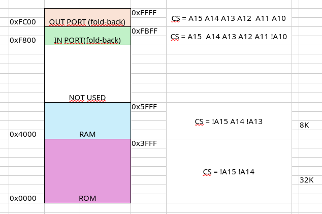

# Answers

## Análise do mapa de endereçamento

### 1. Indique, justificando se a capacidade de memória no sistema é plenamente acessível


### 2. Comente a seguinte afirmação: *"A zona compreendida entre os endereços D000 e DFFF é interdita"*

A afirmação está errada uma vez que a zona referida é a zona de *"chip select" dos portos de entrada e saída.


## Defenição do logigrama do sistema

### 3. Comente a seguinte armação: *"Para implementar o módulo de memória associado às regiões identicadas no mapa de endereçamento por #2 é preferível utilizar circuitos de memória RAM de 4 K × 8 ao invés de circuitos de 2 K × 8 ou 8 K × 16."*

Por um lado se compararmos 4K x 8 com 2K x 8, neste nosso mapa de memória, os primeiros seriam preferíveis pois são mais eficientes em termos de espaço. para alcançar a mesma capacidade, precisariamos do dobro dos módulos.
Por questões de flexibilidade de design e custo-benefício, usar módulos de 4K x 8 é preferível aos módulos de 8K x 16.
Existe também a questão da compatiblidade com o ISA do processador, módulos de 8K x 16 não permitiriam o endereçamento a 8 bits. 

### 4. Sabendo que dispõem de circuitos RAM de 4 K × 8, ROM de 16 K × 16, registos do tipo latchD, com 8 bits e 16 bits, e tri-state buers, com 8 bits e 16 bits, 

- ### a) Desenhe o logigrama do sistema na parte respeitante às zonas de endereçamento identicadas com #1, explicitando todos os sinais envolvidos. 

​	

- ### b) Desenhe o logigrama do sistema na parte respeitante às zonas de endereçamento identicadas com #2, explicitando todos os sinais envolvidos. 

  

- ### c) Desenhe o logigrama do sistema na parte respeitante às zonas de endereçamento identicadas com #3, explicitando todos os sinais envolvidos. 

​	

- ### d) Desenhe o logigrama do sistema na parte respeitante às zonas de endereçamento identicadas com #4, explicitando todos os sinais envolvidos

​	

## Caracterização da actividade dos barramentos

### 5. Numa tabela com o formato indicado na Tabela 1, apresente a atividade dos sinais em referência dos barramentos do processador, quando observados passo-a-passo, para a execução do troço de código apresentado na Listagem 1 sobre o sistema objeto de estudo. 

### Utilize os símbolos **z** e **conf** para identicar a ocorrência de alta impedância e conito, respetivamente, e considere os seguintes valores iniciais para os registos do processador: **R1**=**0x0012**, **R2**=**0x3FFC**, **R3**=**0x2431**, **R6**=**0xBFFE**, **SP**=**0x4000** e **PC**=**0x0000**.


```assembly
	.text
	push r1
	ldr  r1, [ r2, # 2 ]
	add  r0, r2, # 1
	strb r3, [ r2, # 5 ]
	ldr  r4, value
	ldrb r5, [ r6, # 0 ]
	b 	 .
value :
	.word value1
	.data
value1 :
	.word value2
	...
value2 :
	.word 0x1342
```

> Listagem 1: Código objecto de estudo


| Instrução         | nRD  | nWRH | nWRL | Address | Data     |
| ----------------- | ---- | ---- | ---- | ------- | -------- |
| push r1           | 0    | 1    | 1    | 0x0012  | 0x2401   |
|                   | 1    | 0    | 0    | 0x3FFE  | 0x0012   |
| ldr r1, [r2, #2]  | 0    | 1    | 1    | 0x0014  | 0x00A1   |
|                   | 0    | 1    | 1    | 0x3FFE  | **conf** |
| add r0, r2, #1    | 0    | 1    | 1    | 0x0016  | 0xA0A0   |
| strb r3, [r2,#5]  | 0    | 1    | 1    | 0x0018  | 0x2AA3   |
|                   | 1    | 1    | 0    | 0x4001  | **z**    |
| ldr r4, value     | 0    | 1    | 1    | 0x001A  | 0x0C24   |
|                   | 0    | 1    | 1    | 0x0022  | 0x0022   |
| ldrb r5, [r6, #0] | 0    | 1    | 1    | 0x001C  | 0x0865   |
|                   | 0    | 1    | 1    | 0xBFFE  | 0x0012   |
| b .               | 0    | 1    | 1    | 0x001E  | 0x5BFF   |
| value             |      |      |      | 0x0020  | 0x0022   |
| value1            |      |      |      | 0x0022  | 0x0024   |
| value2            |      |      |      | 0x0024  | 0x1342   |


## Teste do sistema

### 6. Implemente, em linguagem assembly do P16, um programa que, continuamente, lê o estado do dispositivo **INPORT** e utiliza os bits 3 a 5 obtidos para denir a posição da variável **array** que contém o valor a axar nos 8 bits de maior peso do dispositivo **OUTPORT**, devendo os valores dos 8 bits de menor peso manter-se inalterados. Defina todos os símbolos, variáveis e secções que entender necessário e considere a seguinte denição para a variável **array**: **uint8_t array[] = {1, 2, 4, 8, 16, 32, 64, 128}**.

```ass
;---------------------------------------------------------------------------------
; Ficheiro:  trab03inout.S
; Descricao: Programa desenvolvido para no ambito da questão 6 do trabalho prático 3
; Autores: Grupo 02 da turma 21N (45824 Nuno Venancio, 48070 Daniel Cabaça)     
; Data:      01-05-2024
; 
; IMPORTANTE:
; No assembler p16as.exe defenir o "address" da secção data para evitar conflitos
; p16as.exe -s .data=0x6000 trab03inout.S 
;---------------------------------------------------------------------------------

; ================================================================================
; Definicao dos valores dos simbolos utilizados no programa

.equ	STACK_SIZE, 64		; Dimensao do stack
.equ 	IDX_MASK, 0x38		; InPort são apenas 8 bits
.equ 	OUT_MASK, 0xFF00
.equ 	IN_ADDR, 0xD000
.equ 	OUT_ADDR, 0xD000

; ================================================================================
; Seccao:    startup
; Descricao: Guarda o código de arranque do sistema

	.section startup
	b		_start
	b		.

_start:
	ldr		SP, stack_top_addr
	mov		R0, PC
	add 	LR, R0, #4							; LR = PC + 4
	ldr 	PC, main_addr
	b		.

stack_top_addr:
	.word	stack_top
main_addr:
	.word	main

; ================================================================================
; Seccao:    text
; Descricao: Guarda o código do programa

	.text
;---------------------------------------------------------------------------------
; Rotina: main
; Descricao: Lê, continuamente, o estado do dispositivo INPORT e utiliza os bits 3 a 5
;            obtidos para definir a posição da variável 'array' que contém o valor a
; 			 afixar nos 8 bits de maior peso do dispositivo OUTPORT, mantendo inalterados
;            os valores dos 8 bits de menos peso.
; Entradas: 
; Saidas:
; Efeitos: 
;---------------------------------------------------------------------------------
main:
	push	LR
	push 	R4
	mov		R0, #0
	bl		outport_init
loop:
	bl		inport_read				
	mov		R1, #IDX_MASK & 0xFF
	and		R0, R0, R1
	lsr		R0, R0, #3
	ldr		R1, array_addr
	ldrb	R1, [R1, R0]
	lsl 	R0, R1, #8
	mov		R4, R0  			; save the value of R0
	mov		R0, #OUT_MASK & 0xFF
	movt 	R0, #OUT_MASK>>8 & 0xFF
	bl		outport_clear_bits
	mov 	R0, R4				; restore R0
	bl 		outport_set_bits
	b 		loop
	pop 	R4
	pop		PC

array_addr:
	.word array

;---------------------------------------------------------------------------------
; Rotina: outport_init
; Descricao: Faz a iniciacao do sistema, atribuindo o valor value aos pinos do
; porto de saida .
; Entradas: Valor a escrever no porto
; Saidas:
; Efeitos: 
;---------------------------------------------------------------------------------
outport_init:
	push lr
	bl outport_write
	pop pc

;---------------------------------------------------------------------------------	
; Rotina:    outport_write
; Descricao: Atribui aos pinos do porto de saida o valor dos bits correspondentes de value.
; Entradas:  Valor a escrever no porto
; Saidas:    
; Efeitos:   Atualiza o valor da variavel imagem do porto
;---------------------------------------------------------------------------------	
outport_write:
	ldr		r1, outport_img_addr
	str 	r0, [r1, #0]						; nosso porto é de 16 bit
	mov		r1, #OUT_ADDR & 0xFF
	movt	r1, #OUT_ADDR >>8 & 0xFF
	str 	r0, [r1, #0]
	mov		pc, lr

outport_img_addr:
	.word	outport_img

;---------------------------------------------------------------------------------	
; Rotina:    inport_read
; Descricao: Devolve o valor corrente do estado dos pinos do porto de entrada.
; Entradas:  
; Saidas:    Valor corrente do porto
; Efeitos:   
;---------------------------------------------------------------------------------	
inport_read:
	mov		r0, #IN_ADDR & 0xFF
	movt	r0, #IN_ADDR>>8 & 0xFF
	ldrb	r0, [r0, #0]					; nosso porto é de 8 bit
	mov		pc, lr

;---------------------------------------------------------------------------------	
; Rotina:    outport_set_bits
; Descricao: Atribui o valor logico '1' aos pinos do porto de saida identificados 
;			 com o valor 1 no argumento passado a rotina. O estado dos restantes 
;			 bits nao e alterado.
; Entradas:  Mascara com os bits a alterar
; Saidas:    
; Efeitos:   Atualiza o valor da variavel imagem do porto
;---------------------------------------------------------------------------------	
outport_set_bits:
	push	lr
	ldr		r1, outport_img_address
	ldr 	r2, [r1, #0]
	orr		r0, r2, r0
	str 	r0, [r1, #0]
	bl		outport_write
	pop		pc

;---------------------------------------------------------------------------------	
; Rotina:    outport_clear_bits
; Descricao: Atribui o valor logico '0' aos pinos do porto de saida identificados 
;			 com o valor 1 no argumento passado a rotina. O estado dos restantes 
;			 bits nao e alterado.
; Entradas:  Mascara com os bits a alterar
; Saidas:    
; Efeitos:   Atualiza o valor da variavel imagem do porto
;---------------------------------------------------------------------------------	
outport_clear_bits:
	push	lr
	ldr		r1, outport_img_address
	ldr 	r2, [r1, #0]
	mvn		r0, r0
	and		r0, r2, r0
	str 	r0, [r1, #0]
	bl		outport_write
	pop		pc

outport_img_address:
	.word	outport_img

; ================================================================================
; Seccao:    data
; Descricao: Guarda as variáveis globais

	.data
outport_img:
	.space 2
array:
	.byte 1, 2, 4, 8, 16, 32, 64, 128

; ================================================================================
; Seccao:    stack
; Descricao: Implementa a pilha com o tamanho definido pelo simbolo STACK_SIZE

	.stack
	.space	STACK_SIZE
stack_top:

```


## Evolução da arquitetura

### 7. Apresente o mapa de endereçamento do novo conjunto, nele inscrevendo as funcionalidades, as dimensões e os endereços de início e de m do espaço atribuído a cada dispositivo/conjunto de dispositivos e, se for o caso, indicando também a localização de zonas de fold-back ou interditas (também designadas por "conito") e a ocorrência de subaproveitamento em dispositivos.

