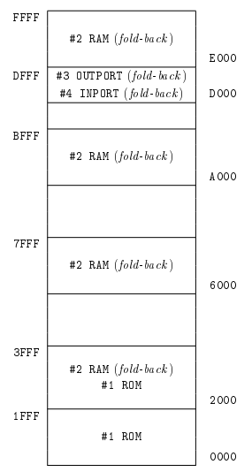
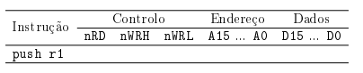

# Assignment 3

## 1 Introduction

The main objective of this assignment is to study the addressing mechanisms used by modern processors to access memory devices and peripherals.

Taking as an example a system based on the P16 processor, the use of memory modules and parallel input and output ports, the exploitation of the respective signals are discussed
and the generation of address selection signals assigned to the devices involved, with emphasis on their representation on address maps.

## 2 Exercise Specifications

The work to be carried out focuses on a system based on the P16 processor with the addressing map shown in the next figure, where the OUTPORT device is a 16-bit parallel output port, with word-wise and byte-wise access, and the INPORT device is an 8-bit parallel input port, accessible at the 0xDFFF address.



## 3 Work to be done

### Addressing Map Analysis

1. Indicate, justifying, whether the memory capacity installed in the system is fully accessible.
2. Comment out the following affirmation: "The zone between addresses D000 and DFFF is
   forbidden."

### Definition of the system logigram

3. Comment on the following affirmation: "To implement the memory module associated with the regions identified in the addressing map by #2 it is preferable to use 4 K × 8 RAM circuits instead of 2 K × 8 or 8 K × 16 circuits."
4. Knowing that they have 4K × 8 RAM circuits, 16K × 16K ROM, 8-bit and 16-bit latch-D registers, and 8-bit and 16-bit tri-state buffers:
   1. Draw the logigram of the system in the part concerning the addressing zones identified with #1, explaining all the signs involved.
   2. Draw the logigram of the system in the part concerning the addressing zones identified with #2, explaining all the signs involved.
   3. Draw the logigram of the system in the part concerning the addressing zones identified with #3, explaining all the signs involved.
   4. Draw the logigram of the system in the part concerning the addressing zones identified with #4, explaining all the signs involved.

### Characterization of buses activity

5. In a table with the format indicated in the following table, display the activity of the signals in reference to the processor buses, when observed step-by-step, for execution
   of the section of code presented on the system under study.  

   Use the **z** and **conf** symbols to identify the occurrence of high impedance and conflict, respectively, and consider the following initial values for the processor registers:
   R1=0x0012, R2=0x3FFC, R3=0x2431, R6=0xBFFE, SP=0x4000 and PC=0x0000.

​	

```assembly
	.text
	push r1
	ldr  r1, [r2, #2]
	add  r0, r2, #1
	strb r3, [r2, #5]
	ldr  r4, value
	ldrb r5, [r6, #0]
	b    .
value:
	.word value1
	
	.data
value1:
	.word value2
	...
value2:
	.word 0x1234
```

### System test

6. Implement, in P16 assembly language, a program that continuously reads the state
   of the INPORT device and uses the bits 3 to 5 obtained to define the position of the array variable containing the value to be displayed in the 8 heavier bits of the OUTPORT device, and the values of the 8 bits with the heaviest weight should remain unchanged. Define as many symbols, variables, and sections as you deem necessary, and consider the following definition for the array variable: ```uint8_t array[] = {1, 2, 4, 8, 16, 32, 64, 128}```.

### Architecture evolution

It is intended to reformulate the system presented by complying with the following criteria:

- Use all existing memory modules;
- Prevent the existence of no-go zones;
- Prevent the existence of fold-back to the memory modules;
- Ensure that the capacity of each memory module is fully utilized;
- Ensure the execution of the program immediately after the connection of the electricity;
- Implement the changes that are strictly necessary.

7. Present the address map of the new set, inscribing in it the functionalities, dimensions and start and end addresses of the space allocated to each device/set of devices and, if applicable, also indicating the location of fold-back or no-go zones (also called "conflict") and the occurrence of underutilization in devices

## Evaluation

The work must be carried out in a group and counts towards the evaluation process of the unit Computer Architecture.

The submission of the work consists of the submission of the answers to all the questions formulated in the work statement through the activity "Delivery of the 3rd Evaluation Work" available at meta discipline page of the course unit on ISEL's Moodle platform. It is recommended that only one of the elements of each group of students submits the work.

> The deadline for submission is May 8, 2024

After the delivery of the work, a date and time may be agreed with some group(s) to hold a discussion for the presentation and defense of the work carried out, situations that will be duly justified.

[**Answers**](./Answers.md)


