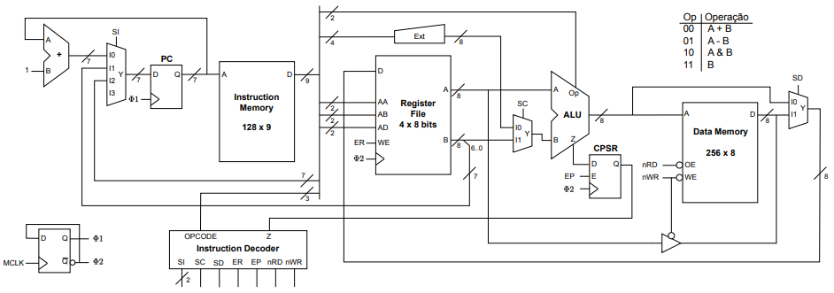
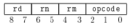
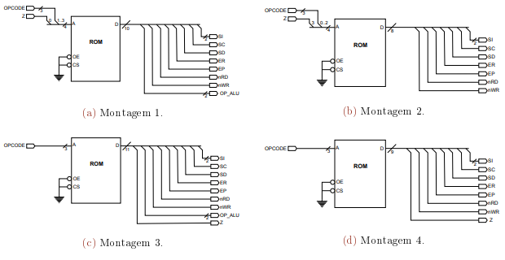

# Assignment 2

## 1 Introduction

The main objective of this assignment is to understand the functioning of a computer processor, and the following topics are addressed: 

- coding of a set of instructions, 
- functioning of a microarchitecture
- coding of programs in machine language (machine code)

## 2 Exercise Specification

It is intended to complete the design of a processor, respecting its programming model and microarchitecture. The processor under consideration is 8-bit and has the following programming model:

- Address spaces for code and data with, respectively, 128 and 256 addresses;
- Four general purpose registers, named r0, r1, r2, r3;
- A status register, called a CPSR (Current Program Status Register), which provides a bit indicating whether the last operation performed produced a zero (Z) result;
- The set of instructions shown in the next table

| **Instruction**        | **Description**                                              | Notes                                        |
| ---------------------- | ------------------------------------------------------------ | -------------------------------------------- |
| ```b rn```             | Changes execution to the address defined by the rn content   | PC <- rn                                     |
| ```bzc #imm7```        | Switches execution to the address defined by imm7 when the CPSR Z flag displays a value of zero | Z == 0 ? PC <- imm7 : PC <- PC + 1           |
| ```ldr rd, [#imm4]```  | Copies to rd the contents of the data memory position whose address corresponds to the value of the imm4 constant. | rd <- M[imm4]                                |
| ``` mov rd, rn```      | Copies to rd the contents of rn                              | rd <- rn                                     |
| ``` sub rd, rn, rm ``` | Subtracts the content of rn from the content of rm, putting the result in rd and updating the CPSR record with the information of the Z bit generated in the ALU | rd <- rn - rm<br />rd == 0 ? Z <- 1 : X <- 0 |
| ``` str rd, [rn]```    | Copies the contents of rd to the position of the data memory with the address defined by the contents of rn | M[rn] <- rd                                  |
| ```tst rn, rm ```      | Performs the bit-by-bit logical AND operation between the rn content and the rm content, updating the CPSR with the value of the Z bit generated in the ALU. | rn & rm == 0 ? Z <- 1 : Z <- 0               |



## 3 Work to be done

### 3.1 Microarchitecture analysis

Consider the description of the processor microarchitecture shown in the figure.
1. Comment on the following statement: *"The microarchitecture of the processor is von Neumann-like."*
2. Indicate, justifying, the functionality of the **Ext** module.
3. Indicate and justify the addressing modes associated with the **b** and **bzc** instructions and discuss the advantages and disadvantages of these addressing modes in relation to the following aspects: 
   1. ) program code density;  
   2. ) flexibility for the in-memory location of instructions and 
   3. ) support for the implementation of routines

### 3.2 Encoding of instructions

Consider using a fixed-length code and a uniform encoding scheme for encoding the instruction set presented in the above table.

1. Provide an encoding map for the instruction set, taking into account the encoding format of the **sub** instruction shown in the figure. 
2. Knowing that the value 001 corresponds to the opcode of the sub statement, enter the values in this field for the remaining instructions. Justify your answer.
3. Indicate, justifying, an advantage and a disadvantage of using a uniform fixed-length code for the encoding of the instruction set presented.

### 3.3 Instructions Decoder project design

Consider the **Instruction Decoder** subcircuit shown in the figure above, which implements the instruction decoder of the proposed microarchitecture for the processor.

1. Using a table with the format indicated in the next table, present the output values of this block, depending on its input signals, to the set of instructions displayed. Explain the cases of indifference (don't care) and, if applicable, the outputs obtained directly from the instruction code.
2. Whereas the **Instruction Decoder** block is intended to be implemented using a ROM, indicate the assembly you would choose from the four logical diagrams presented in the next figure.  Justify your answer.



3. Indicate in bits the capacity of the ROM memory referred to in point 2. Justify your answer.

### 3.4 Encoding of programs in machine language

Translate the code snippet shown in Listing 1 to the processor machine code. Use a table with the format given in Table 3 to record the result of this encoding, whereas each row of the table should correspond to only one instruction of the program, and that the ```LDR R0, [#0]``` instruction, should be located in the memory position with the zero address.
Represent in hexadecimal notation, using four digits, the values of memory addresses and program instructions

```assembly
	ldr	r0, [#0]
	ldr	r1, [#1]
	tst	r0, r1
	bzc	skip
	mov	r0, r1
	sub	r2, r2, r2
	str	r0, [r2]
skip:
	b	r2
```

| **Instruction**    | Address | Machine Code |
| ------------------ | ------- | ------------ |
| ```ldr r0, [#0]``` |         |              |

## Evaluation

The work must be carried out in a group and counts towards the evaluation process of the unit Computer Architecture.

The submission of the work consists of the submission of the answers to all the questions formulated in the work statement through the activity "Delivery of the 2nd Evaluation Work" available at meta discipline page of the course unit on ISEL's Moodle platform. It is recommended that only one of the elements of each group of students submits the work.

> **The deadline for submission is April 15, 2024**

After the delivery of the work, a date and time may be agreed with some group(s) to hold a discussion for the presentation and defense of the work carried out, situations that will be duly justified.