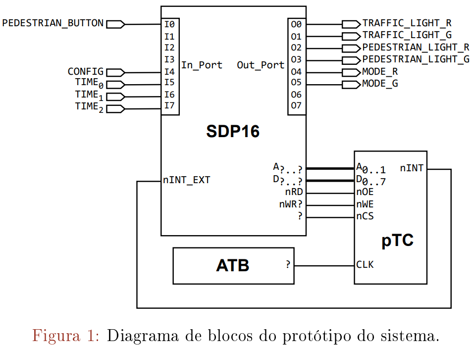
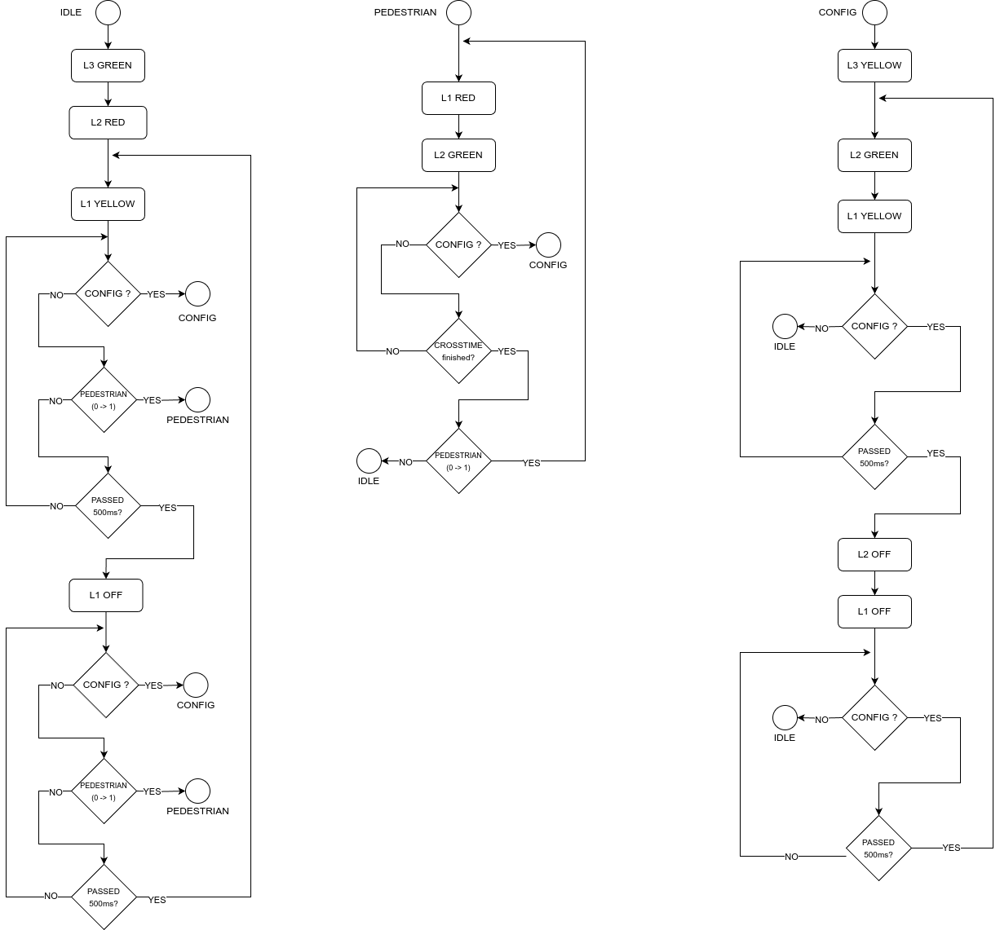

# Trabalho de Projeto

## 1 Introdução

Este trabalho tem como principal objetivo a exploração do hardware envolvente de um processador no desenvolvimento de programas escritos em linguagem *assembly*. Estão envolvidos os seguintes tópicos: 

- entrada e saída de dados, 
- temporização, 
- interrupções externas, 
- organização de programas em rotinas e 
- implementação de máquinas de estados em software.

## 2 Descrição do trabalho a realizar

Pretende-se o desenvolvimento do protótipo de um sistema embebido baseado no processador P16 que implemente o controlador de um sistema de semáforos para uma passadeira. Este sistema é composto por 

- i) um sinal luminoso circular para veículos, com uma única luz que pode acender com as cores vermelho e amarelo,
-  ii) um sinal luminoso circular para peões, também com uma única luz mas que pode acender com as cores vermelho e verde, e 
- iii) um botão de pressão para os peões solicitarem o atravessamento da faixa de rodagem. 
- O sistema inclui ainda quatro interruptores para a configuração do tempo que o sinal verde de travessia de peões deve estar aberto.

## 3 Arquitetura de protótipo

O protótipo a desenvolver deverá ser implementado recorrendo às placas ATB e SDP16, com o módulo LAPI, e ao circuito Pico Timer/Counter (pTC), conforme ilustrado na figura.

Nesta implementação, o botão de pressão **PB1** do módulo de expansão **LAPI** será utilizado para simular os pedidos de atravessamento dos peões, impondo o valor do sinal **PEDESTRIAN_BUTTON**. Este interruptor está ligado à entrada **I0** do porto de entrada instalado na placa **SDP16**. Já o **interruptor 4 do DIP-switch SW1** instalado na placa **SDP16** será utilizado para estabelecer o valor do sinal **CONFIG**, que impõe o modo de funcionamento do sistema: 

- **operação**, quando **CONFIG = '0'**, ou 
- **configuração**, quando **CONFIG = '1'**.

Finalmente, os **interruptores 5 a 7 desse DIP-switch** serão utilizados para estabelecer o valor do sinal **TIME**, utilizado para denir o tempo que o sinal verde de travessia de peões deve estar aberto (**CROSSING_TIME**). Os três bits desta entrada deverão especificar um **conjunto de cinco valores distintos entre 10 segundos e 60 segundos**.

> 000 - 10s (pré-difinido segundo o ponto 4)
>
> 001 - 20s
>
> 010 - 30s
>
> 011 - 40s
>
> 100 - 50s
>
> (101 e 111 - 60s  ???)

Os *Light-Emitting Diode* (LED) bicolores **L1** e **L2** do módulo de expansão **LAPI** serão utilizados para simular as luzes dos semáforos para veículos e peões, respetivamente, enquanto o LED bicolor **L3** será utilizado para identificar o modo de funcionamento do sistema. 

> **LED L1** - semáforo veiculos
>
> **LED L2** - semáforo peões
>
> **LED L3** - Modo de funcionamento

O estado do **LED L1** é controlado pelos sinais **TRAFFIC_LIGHT_R** e **TRAFFIC_LIGHT_G** da seguinte forma: 

- **apagado** quando ambos os sinais tomam o valor '0', 
- **aceso com a cor vermelho** quando **TRAFFIC_LIGHT_R = '1'** e **TRAFFIC_LIGHT_G = '0'**, 
- **aceso com a cor verde** quando **TRAFFIC_LIGHT_R = '0'** e **TRAFFIC_LIGHT_G = '1'** e 
- **aceso com a cor amarelo** quando **TRAFFIC_LIGHT_R = '1'** e **TRAFFIC_LIGHT_G = '1'**. 

O estado dos **LED L2 e L3** é controlado de forma equivalente usando, respetivamente, os sinais **PEDESTRIAN_LIGHT_R** e **PEDESTRIAN_LIGHT_G** e os sinais **MODE_R** e **MODE_G**.

 Os **três LED** estão associados às **saídas 00 a 05** do porto de saída instalado na placa SDP16.

Por último, o circuito **pTC** servirá de suporte à realização das bases de tempo necessárias ao funcionamento do sistema. O **sinal de relógio** aplicado a este circuito será obtido do oscilador ('**OSCILLATOR**') disponível na placa **ATB**.

## Especificação do funcionamento do sistema

### Modo Operação

O sistema deve cumprir o seguinte funcionamento quando está selecionado o modo ***operação***:

- Normalmente, o sistema encontra-se num estado em que o **LED L1** apresenta uma **luz amarela a piscar** ao ritmo de 0,5 segundos (amarelo intermitente) e o **LED L2** apresenta uma **luz vermelha** permanentemente acesa.
- A deteção de uma **transição ascendente ('0' → '1')** no sinal **PEDESTRIAN_BUTTON** faz evoluir o sistema para um estado em que o **LED L1** apresenta uma **luz vermelha** permanentemente acesa e o **LED L2** apresenta uma **luz verde** permanentemente acesa.
- O sistema mantém-se neste estado, no mínimo, durante um período de tempo **CROSSING_TIME**. Este **tempo deve ser estendido** por iguais períodos sempre que for detetada uma **nova transição** ascendente no sinal **PEDESTRIAN_BUTTON**.
- O sistema retorna ao estado original logo que o tempo de espera se esgote.
- Independentemente do estado em que o sistema se encontre, o **LED L3** deverá apresentar uma **luz verde** permanentemente acesa.
- A qualquer momento o sistema pode **alternar para o modo de configuração**, bastando para tal que o sinal **CONFIG** passe a tomar o valor '**1**'.

### Modo Configuração

No modo de ***configuração***, o sistema deve cumprir o seguinte funcionamento:

- O **LED L3** deverá apresentar uma **luz amarela permanentemente** acesa, enquanto os **LED L1** e **L2** devem apresentar, respetivamente, **luzes amarela e verde a piscarem ao ritmo de 0,5 segundos**.
- O utilizador pode definir o valor do período de tempo **CROSSING_TIME** alterando a combinação nos bits da entrada **TIME**. **O sistema tem um valor pré-definido de 10 segundos**.
- A qualquer momento o sistema pode **retornar ao modo de operação**, bastando para tal que a entrada **CONFIG** volte a tomar o valor '**0**'.

## 5 Questões para serem respondidas no relatório

1. Apresente a solução adotada para ligar o circuito pTC à placa SDP16.
2. Explique os cálculos realizados para determinar as temporizações envolvidas neste trabalho.
3. Indique, justificando, a latência máxima do sistema no atendimento dos pedidos de interrupção gerados pelo circuito pTC. 
4. Indique, justificando, quanto tempo demora, no pior caso, a execução da rotina utilizada para o atendimento da interrupção externa. (6 clks da maior instrução + 1 de preparação das flags + 6 da instr *ldr pc, isr_add*r  + a totalidade de clks da **isr**)

## 6 Avaliação

O trabalho deve ser realizado em grupo e conta para o processo de avaliação da unidade curricular Arquitetura de Computadores (AC).

A entrega do trabalho é realizada através da atividade "Entrega do Projeto de Avaliação" disponível na página de meta disciplina de AC na [plataforma Moodle do ISEL](https://moodle.isel.pt/) e consiste na submissão de um **ficheiro ZIP** com:

- o **ficheiro .S** do programa desenvolvido, devidamente indentado e sucintamente comentado, 
- o correspondente **ficheiro .lst** e 
- um **relatório** sobre o trabalho realizado.

### A data limite para a entrega dos trabalhos é **5 de junho de 2024**.

Após a entrega do trabalho, poderá ser combinado com algum(ns) grupo(s) uma data e hora para a realização de uma discussão para apresentação e defesa do trabalho realizado, situações que serão devidamente justificadas.

## ---- MÁQUINA DE ESTADOS ----

[Relatorio](report.md)

