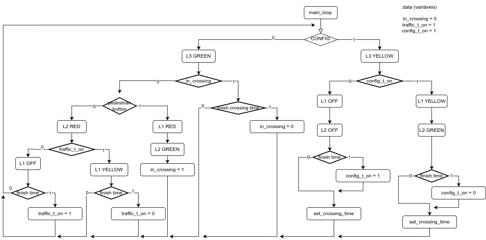
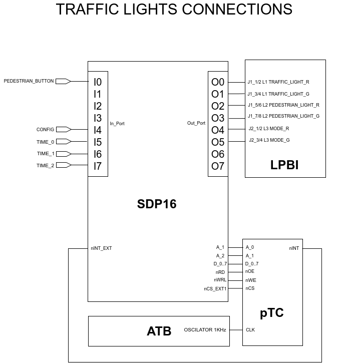

# Relatório do Trabalho de Projeto

## Controlador de semáforos

### Descrição dos elementos relevantes para a compreensão do trabalho

1. Não verificar sinal de CONFIG durante o estado CROSSING?

2. Valores escolhidos para array de crossing_times. São pedidos 5 valores entre 10 a 60 segundos. (10, 20, 30, 40, 50, 60 são 6 valores), poderia ser 10, 23, 36, 49, 60 (+13) ou 10, 22, 34, 46, 60 (+12). No entanto, existe 3 bits para escolher estes valores. 3 bits = 8 valores distintos e não 5.
3. Testar CONFIG antes de PEDESTRIAN_BUTTON ou ao contrário?
4. Na elaboração da rotina main, decidimos fixar 3 registos a valores recorrentemente usados de forma a poupar alguns clocks. R4 - BLINK_TIME (tempo da intermitẽncia do semáforos, 500ms), R5 - ticks observados + BLINK_TIME, e R6 - CONFIG_SW (máscara para o switch config do inport).
5. Máquina de estados utilizada
   

### Respostas às perguntas formuladas no enunciado

#### 1. Solução adotada para ligar o circuito pTC à placa SDP16

#### 2. Cálculos das temporizações

Para calcular as temporizações e como precisamos de 500ms para a intermitẽncia dos semáforos e múltiplos de 10 segundos até ao máximo de 60 para o tempo da passagem do peão, decidimos configurar cada tick a 100ms. Para tal decidimos ligar o OSCILATOR 1KHz e configurar o TMR (timer match register) do Pico Timer/Counter com o valor 99 (0 a 99 = 100 valores), ficando cada tick a uma frequencia de 10Hz = 100ms

#### 3. Latência máxima do sistema no atendimento dos pedidos de interrupção gerados pelo circuito pTC

#### 4. Tempo gasto, no pior caso, na execução da rotina utilizada para o atendimento da interrupção externa

### Conclusões

