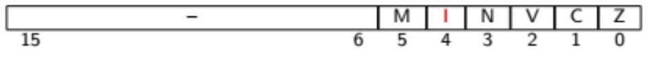

# Laboratory Activity 04

## Preparatory Work

### 3.2.2 

### Indique o valor que deve ser associado ao símbolo ENABLE_EXTINT para que o programa possa dar resposta a pedidos de interrupção externa. Justique a sua resposta.

O valor a associar ao símbolo **ENABLE_EXTINT** é **0x10**. Desse modo conseguimos manipular o bit 4 do registo CPSR correspondente ao atendimento das interrupções (I). Se o I = 0, o atendimento de interrupções está inibido, se I = 1, o atendimento das interrupções é permitido.

 

### 3.2.3 

### Apresente a(s) condição(ões) necessária(s) para a execução do troço de código compreendido entre as linhas 24 e 33 do cheiro lab04_ex1.S.

Para a execução do troço de código correspondente entre as linhas 24 e 33 é necessário que o processador atenda uma interrupção.

### 3.2.4

### Indique a funcionalidade do programa implementado no ficheiro **lab04_ex1.S**

A funcionalidade do programa é contar o número de interrupções existentes.

Inicia a variável global **var** com o valor zero e escreve o valor desta no porto de saída. Em seguida habilita o atendimento das interrupções. Por fim, em loop, lê o valor da variável globar **var** e escreve o seu valor no porto de saída. Por cada interrupção o valor da variável globar **var** é incrementado de 1.

### 3.3

### 3.3.1 

### Indique a funcionalidade do circuito FED apresentado na Figura 1a, que será utilizado para excitar a entrada 'nINT_EXT' da placa SDP16 na segunda fase do trabalho a realizar no laboratório.

O circuito serve para simular uma interrupção na SDP16. A saída !Q será ligada à entrada de interrupções do P16. Enquanto que a entrada AR (Assyncronous Reset) será ligada às saídas da SDP16 que sinalizam que o processador já atendeu a interrupção.

### 3.3.2 

### Explique as alterações introduzidas nos ficheiro **lab04_ex2.S** em relação ao ficheiro **lab04_ex1.S**

Neste ficheiro foi acrescentado um equate **FED_ADDRESS** com o valor **0xFF40** que corresponde ao **nCS_EXT1** do P16, Na rotina main, depois de iniciar a variável global **var** e escrever o seu valor no OutPort é também escrito no FED_ADDRESS um valor aleatório (neste caso o próprio valor do enderenço) para que seja efetuado um RESET assincrono ao FED.
O código referente à rotina a executar durante a interrupção deixou de estar no endereço 0x0002, passando a estar aí um "link" para a nova localização.
Na rotina de interrupção, **isr** passou a conter o código que sinaliza que já está a atender a interrupção, para que seja feito RESET ao FED,

### 3.3.3  

### Indique o sinal da placa SDP16 que deve ser ligado à entrada 'nCS' do circuito FED. Justique a sua resposta.

o sinal nCS_EXT1 que está disponível no TPB (Tie Point Block) B13 linha 4, para que quando haja uma escrita no endereço 0xFF40 este sinal saia a Low (0)

### 3.3.4  Indique o sinal da placa SDP16 que deve ser ligado à entrada 'nCLR' do circuito FED. Justique a sua resposta.

o sinal nWRL que está disponível em TBP (Tie Point Block) B10 linha 2, para que quando haja uma escrita este sinal esteja a Low (0).

