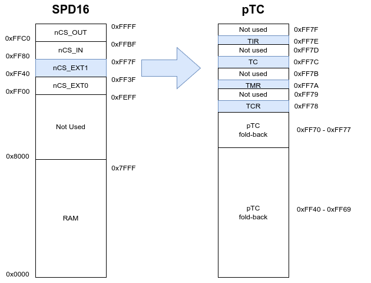
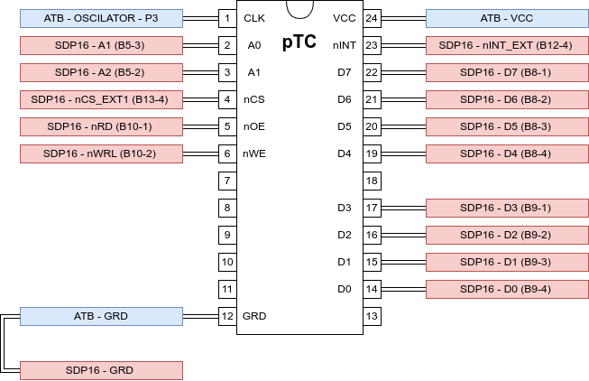

# Laboratory Activity 05

## Objectives

Este trabalho tem como objetivo principal explorar a utilização do circuito Pico Timer/Counter (pTC) para gerar uma base de tempo num sistema computacional baseado no processador P16, designadamente implementar um system clock. A componente experimental do trabalho incide sobre a placa SDP16 e é apoiada pelas ferramentas p16as e p16dbg.

## Preparatory Work

### 3.2 Mapa de endereçamento do sistema

#### Elabore o mapa de endereçamento do sistema objeto de estudo, composto pela placa SDP16 e por um circuito pTC, considerando que o registo TIR do periférico pTC deverá ser acessível no endereço 0xFF7E.

#### Utilize o software [diagrams.net](https://www.diagrams.net/) para desenhar o mapa, que deverá explicitar o tipo, a dimensão e os endereços de início e fim do espaço atribuído a cada dispositivo. Se for o caso, o mapa também deverá explicitar a ocorrência de subaproveitamento e/ou de fold-back e a localização de eventuais zonas interditas (também designadas por "conflito").



### 3.3 Ligação física do circuito pTC ao sistema

#### Utilize o software [diagrams.net](https://www.diagrams.net/) para desenhar o esquema de ligações do circuito pTC às placas SDP16 e ATB, considerando que o sinal de relógio aplicado ao circuito pTC é obtido do Tie-Point Block P3 ('OSCILLATOR') da placa ATB.




### 3.4 Gestor do periférico para o *system clock* (sysclk)

#### 2. Indique o valor que deve ser associado ao símbolo **PTC_ADDRESS**. Justique a sua resposta.

O valor a associar ao símblo **PTC_ADDRESS** é **0xFF78**. Para termos acesso ao TIR do pTC no endereço 0xFF7E, como pedido na questão 3.2 e cujo index será o 6, o valor a associar ao símbolo referido, será 0xFF7E - 6, o que corresponde a 0xFF78. De referir, no entanto, que como existe foldback de 8 em 8 endereços pares desde 0xFF40 a 0xFF7F, poderia ser utilizado, outro valor, desde que multiplo de -8 (-8, -16, -24, -32, ...).

#### 3. Considerando que o sinal de relógio a aplicar ao circuito pTC tem período 1 ms, indique o valor que deve ser associado ao símbolo **SYSCLK_FREQ** para que o intervalo de contagem do periférico pTC corresponda a 100 ms. Justique a sua resposta.

O valor a associar a **SYSCLK_FREQ** para que o intervalo de contagem do pTC corresponda a 100ms e considerando que o sinal **CLK** tem um perídodo de 1ms, é 100, que corresponde a **0x64**

#### 4. Implemente a rotina **sysclk_init**, responsável por iniciar uma nova contagem no circuito pTC com o intervalo de contagem interval, em *ticks*, limpando eventuais pedidos de interrupção pendentes e iniciando com o valor zero a variável global **sysclk**, do tipo **uint16_t**. Considere a seguinte interface para essa rotina:

```c
void sysclk_init ( uint8_t interval );
```

```assembly
; Rotina:    sysclk_init
; Descricao: Inicia uma nova contagem no periferico pTC com o intervalo de
;            contagem recebido em R0, em ticks, limpando eventuais pedidos de
;            interrupcao pendentes e iniciando com o valor zero a variavel
;            global sysclk.
;            Interface exemplo: void sysclk_init( uint8_t interval );
; Entradas:  R0 - Valor do novo intervalo de contagem, em ticks.
; Saidas:    -
; Efeitos:   Inicia a contagem no periferico a partir do valor zero, limpando
;            eventuais pedidos de interrupcao pendentes e iniciando com o
;            valor zero a variavel global sysclk
sysclk_init:
	push 	lr
	push 	r4
	mov		r4, r0 			; preserva o valor do intervalo de contagem, em ticks
	; desablitar as interrupções, penso que não é necessário
	mrs	r0, cpsr
	mov	r1, #0x0F
	and	r0, r0, r1
	msr	cpsr, r0
	; ------------------------------------------------------
	bl 		ptc_clear_irq	; limpar eventuais interrrupts
	bl 		ptc_stop 		; parar o ptc
	; iniciar a varável sysclk a 0 -------------------------
	mov 	r0, #0 && 0xFF
	movt 	r0, #0 >> 8 & 0xFF
	ldr     r1, [sysclk_addr, #0]
	str 	r0, [r1, #0]
	; ------------------------------------------------------
	; reabilitar as interrupções, apenas necessário se tiverem desabilitadas
	mrs	r0, cpsr
	mov	r1, #CPSR_BIT_I
	orr	r0, r0, r1
	msr	cpsr, r0
	; -------------------------------------------------------
	mov 	r0, r4			; repor os ticks
	bl 		ptc_init
	pop 	r4
	pop 	pc

sysclk_add:
	.word sysclk
```


#### 5. Implemente a rotina **sysclk_get_ticks**, que devolve o valor atual da variável global **sysclk**. Considere a seguinte interface para essa rotina:

```c
uint16_t sysclk_get_ticks();
```

```assembly
; Rotina:    sysclk_get_ticks
; Descricao: Devolve o valor corrente da variável global sysclk.
;            Interface exemplo: uint16_t sysclk_get_ticks ( );
; Entradas:  -
; Saidas:    R0 - valor da variável global sysclk
; Efeitos:   -
sysclk_get_ticks:
	ldr     r1, [sysclk_addr, #0]
	ldr 	r0, [r1, #0]
	mov 	pc, lr
```


#### 6. Implemente a rotina **isr**, responsável pelo incremento do valor da variável global **sysclk**. Considere a seguinte interface para essa rotina:

```c
void isr();
```

```assembly
; Rotina:    isr
; Descricao: Incrementa o valor da variável global sysclk.
; Entradas:  -
; Saidas:    -
; Efeitos:   Incrementa o valor da variável global sysclk
isr:
	push	r0
	push	r1
	ldr		r0, sysclk_addr
	ldrb	r1, [r0, #0]
	add		r1, r1, #1
	strb	r1, [r0, #0]
	pop		r1
	pop		r0
	movs	pc, lr
```


#### 7. Implemente a rotina **delay**, que realiza uma espera de **hms** milissegundos por teste sucessivo do valor da variável global **sysclk**. Considere a seguinte interface para essa rotina:

```c
void delay( uint16_t hms );
```

``` assembly
; Rotina:    delay
; Descricao: Rotina bloqueante que realiza uma espera por teste sucessivo
;            do valor da variável global sysclk. O tempo a esperar, em
;            centenas de milissegundos, e passado em R0.
;            Interface exemplo: void delay( uint16_t hms );
; Entradas:  R0 - o tempo a esperar em centenas de milisegundos
; Saidas:    -
; Efeitos:   -
delay:
	push 	lr
	push 	r4
	mov 	r4, r0				; preservar o tempo a esperar em cent. ms.
	bl 		ptc_get_value		; valor atual do pTC
	add 	r4, r4, r0			; somar o valor observado com o tempo a esperar
while:
	bl 		ptc_get_value		; reler o valor actual do pTC
	cmp 	r0, r4				; comparar o valor lido com o valor limite
	blo 	while				; voltar ao while
	pop 	r4
	pop 	pc
```


#### 8. Indique a funcionalidade do programa implementado no ficheiro *lab05.S*.

O programa pisca o LED 0 do outport da placa SPD16 com um *"duty-cicle"* de 0.5 segundos. 0.5 s está aceso, 0.5 s está apagado.


## To Do in Laboratory

### 4.5  Conceção de programas que interagem com um *system clock*

[Knight Rider KITT Efect](https://www.youtube.com/watch?v=wkRXQpzOe3c)

Tomando como base o código disponibilizado no cheiro *lab05.S*, escreva um programa que realize o seguinte efeito luminoso usando os **LED 'O0' a 'O7'** da placa **SDP16**: deslocamento circular para a esquerda de um ponto luminoso, implementado tendo, em cada momento, um **LED** aceso e os restantes sete **LED** apagados. 

O ritmo de evolução do efeito luminoso é imposto pelos **interruptores 0 a 2 do DIP-switch 'SW1'** instalado na placa **SDP16**, estando compreendido na gama **0,5 s, 1 s, 1,5 s, 2 s, 2,5 s, 3 s, 3,5 s, 4 s**. O **interruptor 7 do DIP-switch 'SW1'** é utilizado para reger o funcionamento do programa, habilitando a realização do efeito luminoso quando está na posição **'ON'** ou suspendendo a sua realização na posição contrária. 

Após o arranque do sistema, o **LED 'O0'** deverá estar aceso, enquanto os **LED 'O1' a 'O7'** deverão estar apagados.

