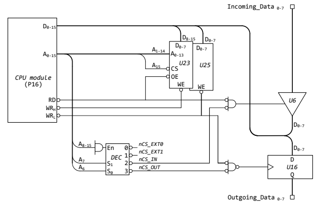
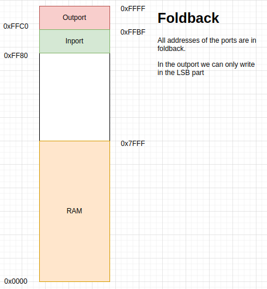

# Laboratorial Activity 03

## 1. Objectives

The main objective of this work is to study the interaction of the P16 processor with I/O generic devices namely parallel input and output ports. The experimental work focuses on the SDP16 board and is supported by the P16As and P16DBG tools.

## 2. Requirements

- SDP16 board with USB cable
- ATB board with USB cable
- Two jumper cables. Dupont male-male (or two wires AWG 22 or 24)
- Personal computer with a native or virtual machine installation of the Microsoft Windows 10 operating system, or a higher version
- Assembler *p16as* for the P16 processor
- Debuger p16db for the P16 processor
- *Visual Studio Code* IDE with P16 plugin or *Notepadd++* editor
- Graphic design software [diagramns.net](https://www.drawio.com)
- lab03.S file

## 3. Preparatory work for laboratory activity

The tasks indicated in this section constitute the preparatory work for this laboratory activity, so they should be carried out in advance of the laboratory session.

### 3.1 Work environment preparation

1. On your personal computer, access the board created to store the work carried out in AC in the current academic semester when preparing [Laboratory Activity 01](https://github.com/oicnanev/CompArch-ISEL-2324/blob/main/Laboratorial activities/lab01)
2. Create a folder named lab03, inside that folder
3. Copy the lab03.S file to the created directory

### 3.2 Characterization of the SDP16 board

Consider the logical diagram shown in figure, corresponding to the implementation schema of the SDP16 board in the part concerning the memory and ports.

1. Characterize the memory devices installed on the SDP16 board in terms of their type, organization and capacity, in bytes. Justify your answer.
2. Characterize the ports installed on the SDP16 card by their type, size, bytes, and modes i.e. word-wise and/or byte-wise. Justify your answer.
3. Elaborate the address map of the system using the diagrams.net software, explaining the features, dimensions, and start and end addresses of the space allocated to each device/set of devices indicated in figure. If applicable, also indicate on the map the occurrence of fold-back and/or no-go zones (also referred to as "conflict") and the occurrence of underutilization on devices.

#### Aswers

1. 
   - Type: RAM (it has WE)
   - Organization and Capacity: 16 x 8 x 2 = 32KB (14bit x 8bit - 16KB) x 2 (Units) = 64KB 
2.  U6:
   - Type: Input port (Tristate connected to the RD)
   - Size: 8 bits (Incoming data 0..7 / Outcoming data 0..7)
   - Modes: byte-wise

​    U16:
 - - Type: Output port (Connected to the WRL)
 - - Size: 8 bits (Incoming data 0..7 / Outcoming data 0..7)

 - - Modes: byte-wise 

3. 

### 3.3 Analysis of programs for interaction with parallel ports

1. Using the Visual Studio Code IDE, or the Notepad++ text editor, open the lab03 file. S and analyze your content.
2. Specify the value that must be associated with the **INPORT_ADDRESS** symbol in order for the **inport_read** routine to interact with the input port installed on the SDP16 card. Justify your answer.
3. Specify the value that must be associated with the **OUTPORT_ADDRESS** symbol in order for the **outport_write** routine to interact with the output port installed on the SDP16 card. Justify your answer.
4. Indicate the functionality of the **sleep** routine and the time required for its execution on the SDP16 card, depending on the value present in the R0 register. Justify your answer.
5. Indicate the functionality of the implemented program in file lab03. S

#### Answers

1. 
2. INPORT_ADDRESS = 0xFF80 (Could be any address from 0xFF80 to 0xFFB8 because all are in foldback)
3. OUTPORT_ADDRESS = 0xFFC0 (Could be any even address from 0xFFC0 to 0xFFFF, because all even addresses are in foldback and odd addresses are not accessible)
4. The sleep routine is a kind of timer, to *"burn time"*, acording to the value of the R0 register.
5. The functionality of the program is to put in the output port, the value, readed from the input port.

