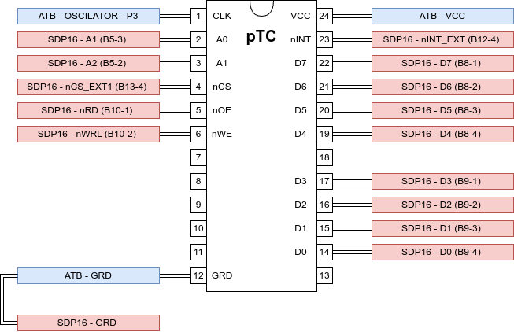

# Laboratory Activity 05

> to run the code in simulation use p16sim -c lab05_config.txt

## Objectives

Este trabalho tem como objetivo principal explorar a utilização do circuito Pico Timer/Counter (pTC) para gerar uma base de tempo num sistema computacional baseado no processador P16, designadamente implementar um system clock. A componente experimental do trabalho incide sobre a placa SDP16 e é apoiada pelas ferramentas p16as e p16dbg.

## Preparatory Work

### 3.2 Mapa de endereçamento do sistema

#### Elabore o mapa de endereçamento do sistema objeto de estudo, composto pela placa SDP16 e por um circuito pTC, considerando que o registo TIR do periférico pTC deverá ser acessível no endereço 0xFF7E.

#### Utilize o software [diagrams.net](https://www.diagrams.net/) para desenhar o mapa, que deverá explicitar o tipo, a dimensão e os endereços de início e fim do espaço atribuído a cada dispositivo. Se for o caso, o mapa também deverá explicitar a ocorrência de subaproveitamento e/ou de fold-back e a localização de eventuais zonas interditas (também designadas por "conflito").


### 3.3 Ligação física do circuito pTC ao sistema

#### Utilize o software [diagrams.net](https://www.diagrams.net/) para desenhar o esquema de ligações do circuito pTC às placas SDP16 e ATB, considerando que o sinal de relógio aplicado ao circuito pTC é obtido do Tie-Point Block P3 ('OSCILLATOR') da placa ATB.




### 3.4 Gestor do periférico para o *system clock* (sysclk)

#### 2. Indique o valor que deve ser associado ao símbolo **PTC_ADDRESS**. Justique a sua resposta.

O valor a associar ao símblo **PTC_ADDRESS** é **0xFF78**. Para termos acesso ao TIR do pTC no endereço 0xFF7E, como pedido na questão 3.2 e cujo index será o 6, o valor a associar ao símbolo referido, será 0xFF7E - 6, o que corresponde a 0xFF78. De referir, no entanto, que como existe foldback de 8 em 8 endereços pares desde 0xFF40 a 0xFF7F, poderia ser utilizado, outro valor, desde que multiplo de -8 (-8, -16, -24, -32, ...).

#### 3. Considerando que o sinal de relógio a aplicar ao circuito pTC tem período 1 ms, indique o valor que deve ser associado ao símbolo **SYSCLK_FREQ** para que o intervalo de contagem do periférico pTC corresponda a 100 ms. Justique a sua resposta.

O valor a associar a **SYSCLK_FREQ** para que o intervalo de contagem do pTC corresponda a 100ms e considerando que o sinal **CLK** tem um perídodo de 1ms, é 10.  1ms corresponde a uma frequencia de 1KHz, para obter uma frequência de 100ms temos de dividir 1KHz por 10, o que corresponde a uma frequência de 100Hz.

#### 4. Implemente a rotina **sysclk_init**, responsável por iniciar uma nova contagem no circuito pTC com o intervalo de contagem interval, em *ticks*, limpando eventuais pedidos de interrupção pendentes e iniciando com o valor zero a variável global **sysclk**, do tipo **uint16_t**. Considere a seguinte interface para essa rotina:

```c
void sysclk_init ( uint8_t interval );
```

```assembly
; Rotina:    sysclk_init
; Descricao: Inicia uma nova contagem no periferico pTC com o intervalo de
;            contagem recebido em R0, em ticks, limpando eventuais pedidos de
;            interrupcao pendentes e iniciando com o valor zero a variavel
;            global sysclk.
;            Interface exemplo: void sysclk_init( uint8_t interval );
; Entradas:  R0 - Valor do novo intervalo de contagem, em ticks.
; Saidas:    -
; Efeitos:   Inicia a contagem no periferico a partir do valor zero, limpando
;            eventuais pedidos de interrupcao pendentes e iniciando com o
;            valor zero a variavel global sysclk
sysclk_init:
	push 	lr
	push 	r0 				; preservar valor dos ticks	
	bl 		ptc_stop 		; parar o ptc
	bl 		ptc_clr_irq		; limpar eventuais interrupts	

	; iniciar a varável sysclk a 0 -------------------------
	mov 	r0, #0 && 0xFF
	movt 	r0, #0 >> 8 & 0xFF
	ldr     r1, sysclk_addr
	str 	r0, [r1, #0]
	; ------------------------------------------------------
	
	pop 	r0 				; repor os ticks
	bl 		ptc_init
	pop 	pc
```


#### 5. Implemente a rotina **sysclk_get_ticks**, que devolve o valor atual da variável global **sysclk**. Considere a seguinte interface para essa rotina:

```c
uint16_t sysclk_get_ticks();
```

```assembly
; Rotina:    sysclk_get_ticks
; Descricao: Devolve o valor corrente da variável global sysclk.
;            Interface exemplo: uint16_t sysclk_get_ticks ( );
; Entradas:  -
; Saidas:    R0 - valor da variável global sysclk
; Efeitos:   -
sysclk_get_ticks:
	ldr     r1, sysclk_addr
	ldr 	r0, [r1, #0]
	mov 	pc, lr
	
sysclk_addr:
	.word sysclk
```


#### 6. Implemente a rotina **isr**, responsável pelo incremento do valor da variável global **sysclk**. Considere a seguinte interface para essa rotina:

```c
void isr();
```

```assembly
; Rotina:    isr
; Descricao: Incrementa o valor da variável global sysclk.
; Entradas:  -
; Saidas:    -
; Efeitos:   Incrementa o valor da variável global sysclk
isr:
	push	r0
	push	r1

	; "limpar" a interrupção no pTC
	ldr		r0, ptc_addr
	strb	r1, [r0, #PTC_TIR]
	; ---------------------------------

	; incrementar sysclk --------------
	ldr		r0, sysclk_addr
	ldrb	r1, [r0, #0]
	add		r1, r1, #1
	strb	r1, [r0, #0]
	; ----------------------------------

	pop		r1
	pop		r0
	movs	pc, lr

ptc_addr:
	.word PTC_ADDRESS
```


#### 7. Implemente a rotina **delay**, que realiza uma espera de **hms** milissegundos por teste sucessivo do valor da variável global **sysclk**. Considere a seguinte interface para essa rotina:

```c
void delay( uint16_t hms );
```

``` assembly
; Rotina:    delay
; Descricao: Rotina bloqueante que realiza uma espera por teste sucessivo
;            do valor da variável global sysclk. O tempo a esperar, em
;            centenas de milissegundos, e passado em R0.
;            Interface exemplo: void delay( uint16_t hms );
; Entradas:  R0 - o tempo a esperar em centenas de milisegundos
; Saidas:    -
; Efeitos:   -
delay:
	push 	lr
	push 	r4
	mov 	r4, r0				; preservar o tempo a esperar em cent. ms.
	bl 		sysclk_get_ticks	; valor atual do sysclk
	add 	r4, r4, r0			; somar o valor observado com o tempo a esperar
while:
	bl 		sysclk_get_ticks	; valor atual do sysclk
	cmp 	r4, r0				; comparar o valor lido com o valor limite
	blo 	while				; voltar ao while
	pop 	r4
	pop 	pc
```


#### 8. Indique a funcionalidade do programa implementado no ficheiro *lab05.S*.

O programa pisca o LED 0 do outport da placa SPD16 com um *"duty-cicle"* de 0.5 segundos. 0.5 s está aceso, 0.5 s está apagado.


## To Do in Laboratory

### 4.5  Conceção de programas que interagem com um *system clock*

[Knight Rider KITT Efect](https://www.youtube.com/watch?v=wkRXQpzOe3c)

Tomando como base o código disponibilizado no ficheiro *lab05.S*, escreva um programa que realize o seguinte efeito luminoso usando os **LED 'O0' a 'O7'** da placa **SDP16**: deslocamento circular para a esquerda de um ponto luminoso, implementado tendo, em cada momento, um **LED** aceso e os restantes sete **LED** apagados. 

O ritmo de evolução do efeito luminoso é imposto pelos **interruptores 0 a 2 do DIP-switch 'SW1'** instalado na placa **SDP16**, estando compreendido na gama **0,5 s, 1 s, 1,5 s, 2 s, 2,5 s, 3 s, 3,5 s, 4 s**. O **interruptor 7 do DIP-switch 'SW1'** é utilizado para reger o funcionamento do programa, habilitando a realização do efeito luminoso quando está na posição **'ON'** ou suspendendo a sua realização na posição contrária. 

Após o arranque do sistema, o **LED 'O0'** deverá estar aceso, enquanto os **LED 'O1' a 'O7'** deverão estar apagados.

```assembly
; Ficheiro:  ap05.S
; Descricao: Programa de suporte a realizacao da 5a atividade laboratorial de
;            Arquitetura de Computadores.
; Autor:     Tiago M Dias (tiago.dias@isel.pt)
; Data:      03-05-2024

; ##############################################################################
; Definicao dos valores dos simbolos utilizados no programa
;
	.equ	CPSR_BIT_I, 0b010000          ; Mascara para o bit I do registo CPSR

	.equ	STACK_SIZE, 64                ; Dimensao do stack - 64 B

	; Definicoes do porto de entrada
	.equ	INPORT_ADDRESS, 0xFF80        ; Endereco do porto de entrada

	; Definicoes do porto de saida
	.equ	OUTPORT_ADDRESS, 0xFFC0       ; Endereco do porto de saida

	.equ	OUTPORT_INIT_VAL, 0           ; Valor inicial do porto de saida

	; Definicoes do circuito pTC
	.equ	PTC_ADDRESS,  0xFF78          ; Endereco do circuito pTC

	.equ	PTC_TCR, 0                    ; Deslocamento do registo TCR do pTC
	.equ	PTC_TMR, 2                    ; Deslocamento do registo TMR do pTC
	.equ	PTC_TC,  4                    ; Deslocamento do registo TC do pTC
	.equ	PTC_TIR, 6                    ; Deslocamento do registo TIR do pTC

	.equ	PTC_CMD_START, 0              ; Comando para iniciar a contagem no pTC
	.equ	PTC_CMD_STOP, 1               ; Comando para parar a contagem no pTC

	.equ	SYSCLK_FREQ, 0x0A             ; Intervalo de contagem do circuito pTC
                                          ; que suporta a implementação do sysclk
										  ; T = 1 / f  
										  ; 0.001s = 1 / 1000Hz
										  ; 0.1s   = 1 / f ( f = 10Hz ) 

	; Outras definicoes
	.equ	LED0_MASK, 1                  ; Mascara para o LED O0 da placa SDP16
	.equ	BLINK_TIME, 5                 ; Número de interrupções a manter o LED no mesmo estado
	.equ 	IN_7_MASK, 128				  ; Mascara para o interruptor 7 do DIP-switch
	.equ 	RHYTHM_MASK, 0x07			  ; Mascara para ir buscar os bits 0 a 2 do inport

; ##############################################################################
; Seccao:    startup
; Descricao: Guarda o código de arranque do sistema
;
	.section startup
	b		_start
	ldr		pc, isr_addr
_start:
	ldr		sp, stack_top_addr
    mov 	r0, pc
    add 	lr, r0, #4
	ldr		pc, main_addr
    b   	.

stack_top_addr:
	.word	stack_top
main_addr:
	.word	main
isr_addr:
	.word	isr

; ##############################################################################
; Seccao:    text
; Descricao: Guarda o código do programa
;
	.text

; Rotina:    main --------------------------------------------------------------
; Descricao: *** Para completar ***
; Entradas:  -
; Saidas:    -
; Efeitos:   *** Para completar ***
main:
	mov		r0, #OUTPORT_INIT_VAL
	bl		outport_init
	mov		r0, #SYSCLK_FREQ
	bl		sysclk_init
	mrs		r0, cpsr
	mov		r1, #CPSR_BIT_I
	orr		r0, r0, r1
	msr		cpsr, r0

	; Após o arranque do sistema, o LED 'O0' deverá estar aceso, enquanto os 
	; LED 'O1' a 'O7' deverão estar apagados.  
	mov		r0, #LED0_MASK
	bl		outport_set_bits
main_loop:
	bl 		inport_read
	mov 	r1, #IN_7_MASK
	and 	r2, r1, r0			  ; aplicar a máscara para ficar apenas com o 7 bit
	cmp 	r1, r2				  ; ver se o 7 bit está activo
	bne 	main_loop			  ; manter-se no main_loop
	mov 	r1, #RHYTHM_MASK
	and 	r2, r0, r1			  ; ver quais os bits 0 a 3 ligados
	ldr 	r1, led_rhythm_addr
	ldrb  	r0, [r1, r2]		  ; ritmo do efeito luminoso
	ldr 	r1, rhythm_img_addr
	ldrb 	r1, [r1, #0]		  ; ir buscar o ritmo anterior
	cmp 	r0, r1				  ; se o ritmo for diferente do anterior
	mov 	r5, r0 				  ; guardar o valor do ritmo
	bne     set_new_rhythm        ; configurar e guardar imagem do novo ritmo
	bne 	sysclk_init 		  ; configurar o sysclk com novo ritmo
	ldr 	r0, outport_img_addr_link  ; ir buscar o valor do bit acesso a outport_img
	ldrb 	r0, [r0, #0]
	mov 	r4, r0				 ; guardar o valor do bit aceso 
	bl      outport_clear_bits   ; apagar o LED
	bl 		delay
	mov 	r0, r4 				 ; repor o valor do bit aceso
	ror 	r0, r0, #7 		     ; rotate right, inverse a rotate left (not in microarch)
	mov 	r1, #0x00			 ; ver se o rotate right deixou o bit na parte alta
	movt	r1, #0x01
	cmp 	r0, r1
	blo 	main_set_bits
	lsr		r0, r0, #8 			 ; meter o valor na parte baixa de r0
main_set_bits:
	bl 		outport_set_bits	 ; acender o novo LED
	mov 	r0, r5				 ; repor o valor do ritmo
	bl 		delay
	b 		main_loop
	b 		.

;Rotina set_new_rhythm ---------------------------------------------------------------------
; R0 tem o valor do novo ritmo
set_new_rhythm:
	push 	r0
	b 	    sysclk_init
	ldr 	r1, rhythm_img_addr
	pop 	r0
	strb    r0,[r1, #0]
	mov 	pc, lr

led_rhythm_addr:
	.word led_rhythm

rhythm_img_addr:
	.word rhythm_img

outport_img_addr_link:
	.word outport_img

; Rotina:    delay -------------------------------------------------------------
; Descricao: Rotina bloqueante que realiza uma espera por teste sucessivo
;            do valor da variável global sysclk. O tempo a esperar, em
;            centenas de milissegundos, e passado em R0.
;            Interface exemplo: void delay( uint16_t hms );
; Entradas:  R0 - o tempo a esperar em centenas de milisegundos
; Saidas:    -
; Efeitos:   -
delay:
	push 	lr
	push 	r4
	mov 	r4, r0				; preservar o tempo a esperar em cent. ms.
	bl 		sysclk_get_ticks	; valor atual do sysclk
	add 	r4, r4, r0			; somar o valor observado com o tempo a esperar
while:
	bl 		sysclk_get_ticks	; reler o valor atual do sysclk
	cmp 	r4, r0				; comparar o valor lido com o valor limite
	blo 	while				; voltar ao while
	pop 	r4
	pop 	pc


; Rotina:    isr ---------------------------------------------------------------
; Descricao: Incrementa o valor da variável global sysclk.
; Entradas:  -
; Saidas:    -
; Efeitos:   Incrementa o valor da variável global sysclk
isr:
	push	r0
	push	r1

	; "limpar" a interrupção no pTC
	ldr		r0, ptc_addr
	strb	r1, [r0, #PTC_TIR]
	; ---------------------------------

	; incrementar sysclk --------------
	ldr		r0, sysclk_addr
	ldrb	r1, [r0, #0]
	add		r1, r1, #1
	strb	r1, [r0, #0]
	; ----------------------------------

	pop		r1
	pop		r0
	movs	pc, lr

ptc_addr:
	.word PTC_ADDRESS

; Rotina:    sysclk_init -------------------------------------------------------
; Descricao: Inicia uma nova contagem no periferico pTC com o intervalo de
;            contagem recebido em R0, em ticks, limpando eventuais pedidos de
;            interrupcao pendentes e iniciando com o valor zero a variavel
;            global sysclk.
;            Interface exemplo: void sysclk_init( uint8_t interval );
; Entradas:  R0 - Valor do novo intervalo de contagem, em ticks.
; Saidas:    -
; Efeitos:   Inicia a contagem no periferico a partir do valor zero, limpando
;            eventuais pedidos de interrupcao pendentes e iniciando com o
;            valor zero a variavel global sysclk
sysclk_init:
	push 	lr
	push 	r0 				; preservar valor dos ticks	
	bl 		ptc_stop 		; parar o ptc
	bl 		ptc_clr_irq		; limpar eventuais interrupts	

	; iniciar a varável sysclk a 0 -------------------------
	mov 	r0, #0 && 0xFF
	movt 	r0, #0 >> 8 & 0xFF
	ldr	 	r1, sysclk_addr
	str 	r0, [r1, #0]
	; ------------------------------------------------------
	
	pop 	r0 				; repor os ticks
	bl 		ptc_init
	pop 	pc

; Rotina:    sysclk_get_ticks --------------------------------------------------
; Descricao: Devolve o valor corrente da variável global sysclk.
;            Interface exemplo: uint16_t sysclk_get_ticks ( );
; Entradas:  -
; Saidas:    R0 - valor da variável global sysclk
; Efeitos:   -
sysclk_get_ticks:
	ldr     r1, sysclk_addr
	ldr 	r0, [r1, #0]
	mov 	pc, lr

sysclk_addr:
	.word sysclk

; Gestor de periférico para o porto de entrada %%%%%%%%%%%%%%%%%%%%%%%%%%%%%%%%%
;

; Rotina:    inport_read -------------------------------------------------------
; Descricao: Adquire e devolve o valor corrente do porto de entrada.
;            Interface exemplo: uint8_t inport_read( );
; Entradas:  -
; Saidas:    R0 - valor adquirido do porto de entrada
; Efeitos:   -
;
inport_read:
	ldr		r1, inport_addr
	ldrb	r0, [r1, #0]
	mov		pc, lr

inport_addr:
	.word	INPORT_ADDRESS

; Gestor de periférico para o porto de saída %%%%%%%%%%%%%%%%%%%%%%%%%%%%%%%%%%%
;

; Rotina:    outport_set_bits --------------------------------------------------
; Descricao: Atribui o valor logico 1 aos bits do porto de saida identificados
;            com o valor 1 em R0. O valor dos outros bits nao e alterado.
;            Interface exemplo: void outport_set_bits( uint8_t pins_mask );
; Entradas:  R0 - Mascara com a especificacao do indice dos bits a alterar.
; Saidas:    -
; Efeitos:   Altera o valor da variavel global outport_img.
;
outport_set_bits:
	push	lr
	ldr		r1, outport_img_addr
	ldrb	r2, [r1, #0]
	orr		r0, r2, r0
	strb	r0, [r1, #0]
	bl		outport_write
	pop		pc

; Rotina:    outport_clear_bits ------------------------------------------------
; Descricao: Atribui o valor logico 0 aos bits do porto de saida identificados
;            com o valor 1 em R0. O valor dos outros bits nao e alterado.
;            Interface exemplo: void outport_clear_bits( uint8_t pins_mask );
; Entradas:  R0 - Mascara com a especificacao do indice dos bits a alterar.
; Saidas:    -
; Efeitos:   Altera o valor da variavel global outport_img.
;
outport_clear_bits:
	push	lr
	ldr		r1, outport_img_addr
	ldrb	r2, [r1, #0]
	mvn		r0, r0
	and		r0, r2, r0
	strb	r0, [r1]
	bl		outport_write
	pop		pc

; Rotina:    outport_init ------------------------------------------------------
; Descricao: Faz a iniciacao do porto de saida, nele estabelecendo o valor
;            recebido em R0.
;            Interface exemplo: void outport_init( uint8_t value );
; Entradas:  R0 - Valor a atribuir ao porto de saida.
; Saidas:    -
; Efeitos:   Altera o valor da variavel global outport_img.
;
outport_init:
	push	lr
	ldr		r1, outport_img_addr
	strb	r0, [r1]
	bl		outport_write
	pop		pc

outport_img_addr:
	.word	outport_img

; Rotina:    outport_write -----------------------------------------------------
; Descricao: Escreve no porto de saida o valor recebido em R0.
;            Interface exemplo: void outport_write( uint8_t value );
; Entradas:  R0 - valor a atribuir ao porto de saida.
; Saidas:    -
; Efeitos:   -
;
outport_write:
	ldr		r1, outport_addr
	strb	r0, [r1, #0]
	mov		pc, lr

outport_addr:
	.word	OUTPORT_ADDRESS

; Gestor de periférico para o Pico Timer/Counter (pTC) %%%%%%%%%%%%%%%%%%%%%%%%%
;

; Rotina:    ptc_init ----------------------------------------------------------
; Descricao: Faz a iniciacao do periférico pTC, habilitando o seu funcionamento
;            em modo continuo e com o intervalo de contagem recebido em R0, em
;            ticks.
;            Interface exemplo: void ptc_init( uint8_t interval );
; Entradas:  R0 - Valor do novo intervalo de contagem, em ticks.
; Saidas:    -
; Efeitos:   Inicia a contagem no periferico a partir do valor zero, limpando
;            o pedido de interrupcao eventualmente pendente.
;
ptc_init:
    push    lr
	ldr		r1, PTC_ADDR
	mov		r2, #PTC_CMD_STOP
	strb	r2, [r1, #PTC_TCR]
	strb	r0, [r1, #PTC_TMR]
    bl  	ptc_clr_irq
	ldr 	r1, PTC_ADDR
	mov		r2, #PTC_CMD_START
	strb	r2, [r1, #PTC_TCR]
	pop 	pc

; Rotina:    ptc_start ---------------------------------------------------------
; Descricao: Habilita a contagem no periferico pTC.
;            Interface exemplo: void ptc_start( );
; Entradas:  -
; Saidas:    -
; Efeitos:   -
;
ptc_start:
	ldr		r0, PTC_ADDR
	mov		r1, #PTC_CMD_START
	strb	r1, [r0, #PTC_TCR]
	mov		pc, lr

; Rotina:    ptc_stop ----------------------------------------------------------
; Descricao: Para a contagem no periferico pTC.
;            Interface exemplo: void ptc_stop( );
; Entradas:  -
; Saidas:    -
; Efeitos:   O valor do registo TC do periferico e colocado a zero.
;
ptc_stop:
	ldr		r0, PTC_ADDR
	mov		r1, #PTC_CMD_STOP
	strb	r1, [r0, #PTC_TCR]
	mov		pc, lr

; Rotina:    ptc_get_value -----------------------------------------------------
; Descricao: Devolve o valor corrente da contagem do periferico pTC.
;            Interface exemplo: uint8_t ptc_get_value( );
; Entradas:  -
; Saidas:    R0 - O valor corrente do registo TC do periferico.
; Efeitos:   -
;
ptc_get_value:
	ldr		r1, PTC_ADDR
	ldrb	r0, [r1, #PTC_TC]
	mov		pc, lr

; Rotina:    ptc_clr_irq -------------------------------------------------------
; Descricao: Sinaliza o periferico pTC que foi atendido um pedido de
;            interrupção.
;            Interface exemplo: void ptc_clr_irq( );
; Entradas:  -
; Saidas:    -
; Efeitos:   -
;
ptc_clr_irq:
	ldr		r0, PTC_ADDR
	strb	r1, [r0, #PTC_TIR]
	mov		pc, lr

PTC_ADDR:
	.word	PTC_ADDRESS

; ##############################################################################
; Seccao:    data
; Descricao: Guarda as variáveis globais
;
	.data
outport_img:
	.space	1

	.align
sysclk:
	.space	2

led_rhythm:
	.byte	5, 10, 15, 20, 25, 30, 35, 40
	; hex: 05, 0A, 0F, 14, 19, 1E, 25, 28

rhythm_img:
	.byte 0

	.align

; ##############################################################################
; Seccao:    stack
; Descricao: Implementa a pilha com o tamanho definido pelo simbolo STACK_SIZE
;
	.stack
	.space	STACK_SIZE
stack_top:
```

