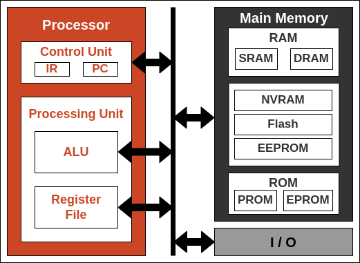
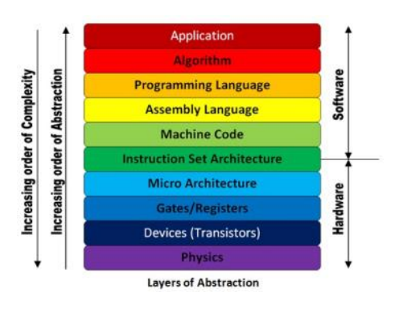
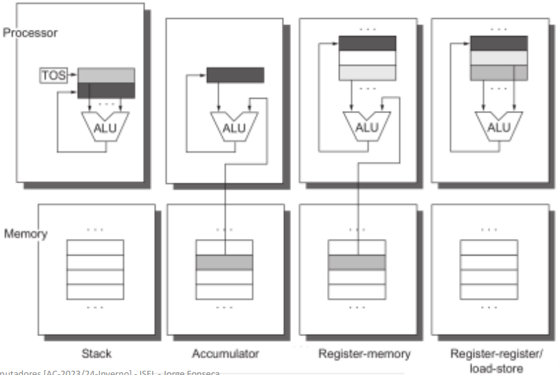
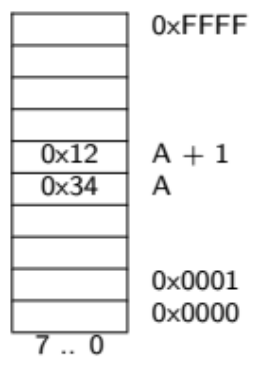
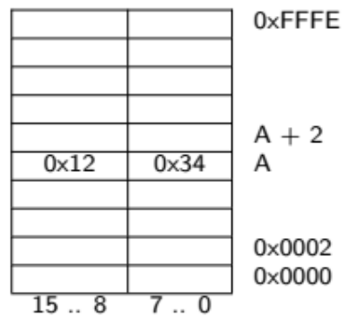

# 1. Architecture of a Computer


## Computer classes


**Computer definition** - digital system programmable through a sequence of instructions, which is used to obtain, process and store data.


**Computer types:**

- Personal computers
- Servers
- Embedded systems


## Organization of a Computer


The internal organization of a computer comprises 3 subsystems:

- Processor or Central Processing Unit (CPU)
- Main Memory subsystem
- Data Input and Output (I/O) subsystem


### Processor


The Processor is responsible for processing the instructions stored in memory.

To this end, its internal structure is based on:

- Processing Unit
- Control Unit



#### Processing Unit

Is composed essentially by:

- **Arithmetic and Logic Unit (ALU)** - supports the performance of the calculations necessary for the execution of the instructions
- **Register File** - stores the operands and results of those calculations 

##### Arithmetic and Logic Unit

- Circuit that performs arithmetic and logic operations generating a set of state bits relative to the calculated result.
- The number, type and complexity of these operations depends on the class of problems in view for the processor.
- Usually, an ULA is implemented using logic purely combinatorial.

##### Register File

- In a digital system, records are the elements that store the data to be processed.
- On a processing unit, the generic usage registers are grouped together in a block called register file.
- The number of registers that make up the register file is set to address the class of problems in view of a given processor.
- Typically:
  - The number of registers is a power of 2; 
  - Each record is referenced by a number.


#### Control Unit

The Control Unit is responsible for the management of the Processor functionality:

- Generate the word / sequence of control *words* that that define the intended functionality for each instruction
- Interaction with main memory and peripherals.

These control words define, among other things:

- The operation to be carried by the ALU
- The registers and constants that serve as operands
- The signals for forwarding data
- Etc.

The control unit receives the status bits from the ALU of the processing unit.
This information makes it possible for the sequences of operations generated by the control unit be dependent on the outcome of other operations, making possible to control the flow of a program execution.


### Memory

The memory subsystem can include one or more memory devices, with different characteristics (e.g. volatile, non-volatile, etc.)

This subsystem is connected to the processor via three buses:

- Address bus
- Data bus
- Control bus

The memory can be RAM (SRAM, DRAM), ROM (PROM, EPROM), NVRAM, Flash or EEPROM:

- RAM - Random-access Memory
  - SRAM - Static Random-access Memory
  - DRAM -Dynamic Random-access Memory
- ROM - Read-only Memory
  - PROM - Programmable Read-only Memory
  - EPROM - Erasable Programmable Read-only Memory
- NVRAM - Non-volatile Random-access Memory
- Flash
- EEPROM - Electronic-erasable Programmable Read-only Memory


### CISC and RISC concepts


#### CISC Processor

The CISC Stands for **Complex Instruction Set Computer**, developed by the Intel. It has a large collection of complex instructions that range from simple to very complex and specialized in the assembly language level, which takes a long time to execute the instructions. So, CISC approaches reducing the number of instruction on each program and ignoring the number of cycles per instruction. It emphasizes to build complex instructions directly in the hardware because the hardware is always faster than software. However, CISC chips are relatively slower as compared to RISC chips but use little instruction than RISC. Examples of CISC processors are VAX, AMD, Intel x86 and the System/360.


**Characteristics**:

- The length of the code is shorts, so it requires very little RAM
- CISC or complex instructions may take longer than a single clock cycle to execute the code
- Less instruction is needed to write an application
- It provides easier programming in assembly language
- Support for complex data structure and easy compilation of high-level languages
- It is composed of fewer registers and more addressing nodes, typically 5 to 20
- Instructions can be larger than a single word
- It emphasizes the building of instruction on hardware because it is faster to create than the software


**CISC Processor Architecture**

The CISC architecture helps reduce program code by embedding multiple operations on each program instruction, which makes the CISC processor more complex. The CISC architecture-based computer is designed to decrease memory costs because large programs or instruction required large memory space to store the data, thus increasing the memory requirement, and a large collection of memory increases the memory cost, which makes them more expensive.


**Advantages of CISC Processors**

- The compiler requires little effort to translate high-level programs or statement languages into assembly or machine language in CISC processors.
- The code length is quite short, which minimizes the memory requirement.
- To store the instruction on each CISC, it requires very less RAM.
- Execution of a single instruction requires several low-level tasks.
- CISC creates a process to manage power usage that adjusts clock speed and voltage.
- It uses fewer instructions set to perform the same instruction as the RISC.


**Disadvantages of CISC Processors**

- CISC chips are slower than RISC chips to execute per instruction cycle on each program.
- The performance of the machine decreases due to the slowness of the clock speed.
- Executing the pipeline in the CISC processor makes it complicated to use.
- The CISC chips require more transistors as compared to RISC design.
- In CISC it uses only 20% of existing instructions in a programming event.


#### RISC Processor

RISC stands for **Reduced Instruction Set Computer Processor**, a microprocessor architecture with a simple collection and highly customized set of instructions. It is built to minimize the instruction execution time by optimizing and limiting the number of instructions. It means each instruction cycle requires only one clock cycle, and each cycle contains three parameters: fetch, decode and execute. The RISC processor is also used to perform various complex instructions by combining them into simpler ones. RISC chips require several transistors, making it cheaper to design and reduce the execution time for instruction.Examples of RISC processors are SUN's SPARC, PowerPC, Microchip PIC processors, RISC-V.


**Advantages of RISC Processor**

- The RISC processor's performance is better due to the simple and limited number of the instruction set.
- It requires several transistors that make it cheaper to design.
- RISC allows the instruction to use free space on a microprocessor because of its simplicity.
- RISC processor is simpler than a CISC processor because of its simple and quick design, and it can complete its work in one clock cycle.


**Disadvantages of RISC Processor**

- The RISC processor's performance may vary according to the code executed because subsequent instructions may depend on the previous instruction for their execution in a cycle.
- Programmers and compilers often use complex instructions.
- RISC processors require very fast memory to save various instructions that require a large collection of cache memory to respond to the instruction in a short time.


**RISC Architecture**

It is a highly customized set of instructions used in portable devices due to system reliability such as Apple iPod, mobiles/smartphones, Nintendo DS, etc.


**Features of RISC Processor**

- **One cycle execution time:** For executing each instruction in a computer, the RISC processors require one CPI (Clock per cycle). And each CPI includes the fetch, decode and execute method applied in computer instruction.
- **Pipelining technique:** The pipelining technique is used in the RISC processors to execute multiple parts or stages of instructions to perform more efficiently.
- **A large number of registers:** RISC processors are optimized with multiple registers that can be used to store instruction and quickly respond to the computer and minimize interaction with computer memory.
- It supports a simple addressing mode and fixed length of instruction for executing the pipeline.
- It uses LOAD and STORE instruction to access the memory location.
- Simple and limited instruction reduces the execution time of a process in a RISC.


#### Difference between the RISC and CISC Processors

| **RISC**                                                     | **CISC**                                                     |
| ------------------------------------------------------------ | ------------------------------------------------------------ |
| It is a Reduced Instruction Set Computer                     | It is a Complex Instruction Set Computer                     |
| It emphasizes on software to optimize the instruction set    | It emphasizes on hardware to optimize the instruction set    |
| It is a hard wired unit of programming in the RISC Processor. | Microprogramming unit in CISC Processor.                     |
| It requires multiple register sets to store the instruction  | It requires a single register set to store the instruction   |
| RISC has simple decoding of instruction                      | CISC has complex decoding of instruction                     |
| Uses of the pipeline are simple in RISC                      | Uses of the pipeline are difficult in CISC                   |
| It uses a limited number of instruction that requires less time to execute the instructions | It uses a large number of instruction that requires more time to execute the instructions |
| It uses LOAD and STORE that are independent instructions in the register-to-register a program's interaction | It uses LOAD and STORE instruction in the memory-to-memory interaction of a program |
| RISC has more transistors on memory registers                | CISC has transistors to store complex instructions           |
| The execution time of RISC is very short                     | The execution time of CISC is longer                         |
| RISC architecture can be used with high-end applications like telecommunication, image processing, video processing, etc | CISC architecture can be used with low-end applications like home automation, security system, etc |
| It has fixed format instruction                              | It has variable format instruction                           |
| The program written for RISC architecture needs to take more space in memory | Program written for CISC architecture tends to take less space in memory |
| Example of RISC: ARM, PA-RISC, Power Architecture, Alpha, AVR, ARC and the SPARC | Examples of CISC: VAX, Motorola 68000 family, System/360, AMD and the Intel x86 CPUs |


## Programming Model (ISA)

 

### Machine Code

Instructions are stored in memory in a format directly interpretable by the processor, that is, in machine language (machine code).
Every machine language instruction is made up of by a set of bits that specify, in a unambiguous, the operations to be carried out and the operands Involved.


### Stored Program concept

Instructions and program data are stored in memory as numbers.

- Advantage - running a different program consists of loading that program into memory, 
  instead of designing a new processor or defining new connections at the of the hardware.


In general, instructions are stored sequentially in memory and are executed in the order in which they are.

- Advantage - this order of execution can be changed by also using instructions, which creates support for controlling the flow of program execution.


### Fetch-Decode-Execute Cycle

The implementation of a program generally consists in the continuous performance of three operations per each Instruction stored in memory:

- Fetch instruction
- Decoding the instruction (decode)
- Execute the instruction

The **Program Counter** keeps the memory address of the next instruction to execute.

The **Instruction Register** keeps the code of the instructions that is being executed in the processor at all times.


### Assembly Language

The **assembly** language offers a higher level of abstraction to the programmer, although it is still very
close to machine language.

Each **assembly** statement corresponds to a statement of machine code which, however, is specified 
using mnemonics and symbolic names, rather than zeros and ones.

Using **assembly** language, the programmer can access all the features of the architecture.

Programming directly in machine language is a time-consuming task that requires a great effort of the programmers, because it is considered a very difficult and inefficient task to avoid.


### Instruction Set Architecture - ISA

Defines the programming model of a computer.

The model comprises:

- List of supported instructions (instruction set)
- Syntax of these instructions
- Supported operand types
  - Constants specified in the instructions themselves
  - Internal processor logs
  - Memory Locations





#### Programing model of a computer

A computer's programming model exposes programmers (and program translation software to machine language - compilers and assemblers) the computer elements that can be used to develop a program.

The model comprises several dimensions:

- How the internal processor stores data internally
- Set of instructions supported by the processor
- Types and size of his operands
- Addressing modes available
- Data organization in memory
- Encoding of instructions




#### Instructions

Instructions can be classified into three broad classes:

- **Data manipulation** - are the ones that perform useful operations in a program, consisting in applying arithmetic or logical operators to operands and, in the storage of these results. Example: Addiction and subtraction
- **Data transfer** - are used to transfer data between the processor's registers, the processor subsystem , the memory and the data input and output systems
- **Control** - allow changing the sequential order of execution of instructions, unconditionally or depending on the results of previous calculations.

#### Operand types

There are four possible types for the operands of an instruction:

- Constants specified in the instructions themselves
- Internal processor logs
- Memory Positions
- Input and output ports


#### Addressing modes

- **Implicit addressing**  - the operand is not specified in the statement. Example: all jump statements of the *branch* form implicitly refer to the current value of the PC register, ```BEQ label```
- **Immediate addressing** - the operand value is embedded in the statement. ```MOV R2,#2```
- **Register addressing** - the operand is the contents of a register specified in the statement.
  ```MOV R2, R1```
- **Direct addressing** - the actual address is specified in the statement. ```MOV R0,[#1]```
- **Indexed addressing** - the effective address is calculated by adding the contents of a base register with the contents of the indexer register. ```MOV R2,[R0,R2]```
- **Relative addressing** - the operand is specified based on the current content of the program counter (PC) register. ```MOV R2,[PC,#8]```
- **Based addressing** - the effective address is calculated by adding the contents of a Base Register to an offset contained in the address field of the statement. ```MOV R2,[RB,#7]```


#### Address

- On a computer, each memory position is identified by an address and stores a given set of bits.
- Normally, each address holds a byte - set of 8 bits - and it is possible to access memory with byte or word granularity, whether at 16, 32, or 64 bits.
- Addresses are treated as natural numbers, taking values between 0 and 2<sup>n</sup> - 1, where *n* corresponds to the number of bits available to encode the addresses.
- The calculation of the effective address of the memory position to be accessed may exceed the domain representation (overflow or underflow). 


#### Alignment

From a logical point of view, the address space can be viewed according to two organizations:

- Organized to word, each with w bits;

- Organized by byte.

  Words are located at multiple addresses of their size.
  The bytes that make up the word located in address A are located in the addresses A to A+w/8.
  Bytes can be located at any address.

| Organized by byte                                            | Organized by 16 bits word                                    |
| ------------------------------------------------------------ | ------------------------------------------------------------ |
|  |  |


#### Endianess

The data is arranged in memory from a base address and is organized as a sequence of contiguous bytes.

The order of the bytes in the sequence can follow the **big-endian** or **little-endian** formats, depending on the type of processor and/or how it operates:

- **little endian** - the byte sequence is stored in memory starting with the least weighted byte of the word (least significant byte - LSB), so this byte associated with the memory position with the lowest address
- **big-endian** - the sequence of bytes is stored in memory starting with the byte with the highest weight of the 
  word (most significant byte – MSB), thus being associated with this byte associated with the memory position with the lowest address.


#### ISA codification

Each statement defined in the ISA has one, and only one, corresponding statement in machine code.

The translation to machine code involves three steps:

- Specification of the operation code (opcode) for the operation
- Specification of the code(s) of the operand(s) of this operation
- Organization of these codes according to a given format


##### Instruction formats

The instruction format defines how its different fields are organized.

The size, in bits, of each field is related to the characteristics of the set of instructions:

- The size of the opcode field results from the size of the instruction set;
- The size of the operands' fields results from the flexibility in their specification.

The ISAs are coded based on three classes of codes:

- Variable length
- Fixed length
- Hybrid

For the sake of efficiency, both performance and memory usage, the instructions must be encoded using uniform formats and without the use of a high number of bits. The most common compromise solutions are:

- Restrict the number of operands;
- Limit the allowed addressing modes;
- Use more than one format to encode instructions.
