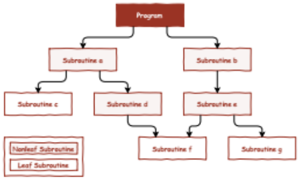

# Assembly Language Programming


*Assembly language* is the human-readable representation of the computer’s native language. Each assembly language instruction specifies both the operation to perform and the operands on which to operate.

## Instructions

- Rd, Rm - (R0 - R15)
- Rn - (R0 - R7)

### Arithmetic

| **Operation** | **Assembly**                 | Flags   | Notes                |
| ------------- | ---------------------------- | ------- | -------------------- |
| Add           | ```add Rd, Rn, #immed_4```   | N Z C V | Rd = Rn + immed_4    |
| Add           | ```add Rd, Rn, Rm```         | N Z C V | Rd = Rn + Rm         |
| Add w/ carry  | ```adc Rd, Rn, Rm```         | N Z C V | Rd = Rn + Rm + carry |
| Sub           | ``` sub Rd, Rn, #immed_4 ``` | N Z C V | Rd = Rn - immed_4    |
| Sub           | ``` sub Rd, Rn, Rm ```       | N Z C V | Rd = Rn - Rm         |
| Sub w/ carry  | ``` sbc Rd, Rn, Rm ```       | N Z C V | Rn = Rn - Rm - carry |


### Logic

| **Operation**      | Assembly               | Flags | Notes          |
| ------------------ | ---------------------- | ----- | -------------- |
| AND                | ``` and Rd, Rn, Rm ``` | N Z   | Rd = Rn AND Rm |
| OR                 | ``` orr Rd, Rn, Rm ``` | N Z   | Rd = Rn OR Rm  |
| XOR (Exclusive OR) | ```eor Rd, Rn, Rm ```  | N Z   | Rd = Rn XOR Rm |


### Shifting

| **Operation**          | Assembly                        | Flags | Notes |
| ---------------------- | ------------------------------- | ----- | ----- |
| Logical shift left     | ``` lsl Rd, Rn, #<immed_4> ```  | N Z C |       |
| Logical shift right    | ``` lsr Rd, Rn , #<immed_4> ``` | N Z C |       |
| Arithmetic shift right | ``` asr Rd, Rn, #<immed_4> ```  | N Z C |       |
| Rotate right           | ``` ror Rd, Rn, #<immed_4> ```  | N Z C |       |
| Rotate right extended  | ``` rrx Rd, Rn ```              | N Z C |       |


### Comparison

| **Operation** | Assembly           | Flags   | Notes          |
| ------------- | ------------------ | ------- | -------------- |
| Compare       | ``` cmp Rn, Rm ``` | N Z C V | CPSR = Rn - Rm |


### Data transfer between registers

| **Operation**         | Assembly                    | Flags   | Notes                   |
| --------------------- | --------------------------- | ------- | ----------------------- |
| Move                  | ``` mov Rd, #<immmed_8> ``` |         | Rd = immed_8            |
| Move                  | ``` mov Rd, Rm ```          |         | Rd = Rm                 |
| NOT                   | ``` mvn Rd, Rm ```          | N Z     | Rd = ! Rm               |
| Move to higher byte   | ``` movt Rd, #<immed_8> ``` |         | Rd[15:8] = immed_8      |
| Move and restore CPSR | ``` movs PC, LR ```         | N Z C V | PC = LC & CPSR = SPSR   |
| Move register to CPSR | ``` msr Rd, CPSR ```        |         | CPSR = Rd (bits 0 to 5) |
| Move register to SPSR | ``` msr Rd, SPSR ```        |         | SPSR = Rd (bits 0 to 5) |
| Move CPSR to register | ``` mrs Rd, CPSR ```        |         | Rd = CPSR               |
| Move SPSR to register | ``` mrs Rd, SPSR ```        |         | Rd = SPSR               |


### Memory data transfer

| **Operation** | Assembly                        | Flags | Notes                                       |
| ------------- | ------------------------------- | ----- | ------------------------------------------- |
| Load word     | `` ldr Rd, labelS ``            |       | Rd = addr(labelS), labelS +- 128KB distance |
| Load word     | ``` ldr Rd, [Rn, #immed_4] ```  |       | Rd = addr(Rn + immed_4)                     |
| Load word     | ``` ldr Rd, [Rn, Rm] ```        |       | Rd = addr(Rn + Rm)                          |
| Load byte     | ``` ldrb Rd, [Rn, #immed_4] ``` |       | Rd[7:0] = addr(Rn + immed_4), Rd[15:8] = 0  |
| Load byte     | ``` ldrb Rd, [Rn, Rm] ```       |       | Rd[7:0] = addr(Rn + Rm), Rd[15:8] = 0       |
| Store word    | ``` str Rd, [Rn, #immed_4] ```  |       | addr(Rn + immed_4) = Rd                     |
| Store word    | ```str Rd, [Rn, Rm] ```         |       | addr(Rn + Rm) = Rd                          |
| Store byte    | ``` strb Rd, [Rn, #immed_4] ``` |       | addr(Rn + immed_4) = Rd[7:0]                |
| Store byte    | ``` strb Rd, [Rn, Rm] ```       |       | addr(Rn + Rm) = Rd[7:0]                     |


### Stack manipulation

| **Operation** | Assembly | Flags | Notes                  |
| ------------- | -------- | ----- | ---------------------- |
| Push          | push Rm  |       | SP = SP - 2, [SP] = Rm |
| Pop           | pop Rd   |       | SP = SP + 2, Rd = [SP] |


### Control

| **Operation**                                 | Assembly                              | Flags | Notes               |
| --------------------------------------------- | ------------------------------------- | ----- | ------------------- |
| Branch                                        | ``` b label ```                       |       | PC = label          |
| Branch with link                              | ``` bl label ```                      |       | LR = PC, PC = label |
| Branch if equal / zero set                    | ``` beq label ``` / ```bzs label ```  |       | PC = label          |
| Branch if not equal / zero clear              | ``` bne label ``` / ``` bzc label ``` |       | PC  = label         |
| Branch if signed less than                    | ``` blt label ```                     |       | PC  = label         |
| Branch if signed greater than or equal        | ``` bge label ```                     |       | PC  = label         |
| Branch if unsigned higher or same / carry set | ``` bhs label ``` / ``` bcs label ``` |       | PC  = label         |
| Branch if unsigned lower / carry clear        | ``` blo label ``` / ``` bcc label ``` |       | PC  = label         |

label - must refer to an address +-1 KB of distance


## Structured programming



In assembly, the modules that make up a program are called **routines**.

If a routine does not invoke any other routine, it is called a **leaf routine**.


### Register conventions

| Name     | Use                                         |
| -------- | ------------------------------------------- |
| R0       | Argument / return value/ temporary variable |
| R1 - R3  | Argument / temporary variables              |
| R4 - R12 | Saved variables                             |
| R13 (SP) | Stack Pointer                               |
| R14 (LR) | Link Register                               |
| R15 (PC) | Program Counter                             |


Example of how to Invoke a routine located at an address at a distance more than ± 1KByte

```assembly
main:
	...					; ry = [r0..r7]
	mov ry, pc			; ry = 0x0120
	add lr, ry, #4		; lr = 0x0124
	ldr pc, dummy_addr	; pc = 0x1C34
	...
	...
dummy_addr:
	.word dummy			; [0x016C] = 0x1C34
    ...
    ...
 dummy:
 	mov pc, lr
```


> First 4 arguments of a function must be passed in the first 4 registers (R0 - R3), next arguments must by passed in the stack

### Example exercise

Develop in P16 assembly, a function to perform the multiplication of two natural numbers **M** and **m**, encoded with 8 bits, using the algorithm of successive additions

```c
uint16_t mul16 (uint8_t M, uint8_t m) {
    uint16_t p = 0;
    while (m > 0) {
        p = p + M;
        m = m - 1;
    } 
    
    return p
}

void main () {
    uint8_t M = 4;
    uint8_t m = 8;
    uint16_t p = mul16(M, m);
}
```


```assembly
; -----------------------------------------------------------------------------
; Ficheiro:  aula9.S
; Descricao: Funcao mul16.
; Autor:     Jorge Fonseca (jorge.fonseca@isel.pt)
; Data:      08-03-2024
; -----------------------------------------------------------------------------

main:
	ldr	 r0,M_addr	;r0 = @M
	ldrb r0,[r0,#0]	;r0 = M
	ldr	 r1,m_addr	;r1 = @m
	ldrb r1,[r1,#0]	;r1 = m
	bl	 mul16
	ldr	 r1,P_addr	;r1 = @P
	str	 r0,[r1,#0]	;r1 = P
	b	 .

M_addr:
	.word M
m_addr:
	.word m
P_addr:
	.word P

; uint16_t mul16 ( uint16_t M(r0), uint16_t m(r1) )
; r0 is the M parameter
; r1 is the m parameter	
mul16:
	mov	r2, #0		; p = 0
while:
	mov	r3, #0		
	cmp	r3, r1		; 0 < m
	bhs	while_end
	add	r2, r2, r0	; p = p + M
	sub	r1, r1, #1	; m = m - 1
	b	while
while_end:
	mov	r0, r2		; r0 = p
	mov	pc, lr

m:
	.byte	8
M:
	.byte	4
P:
	.word	0
```


