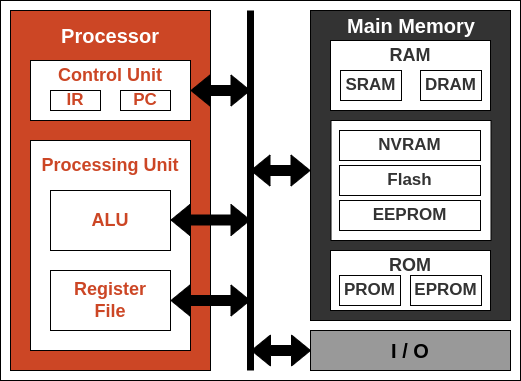
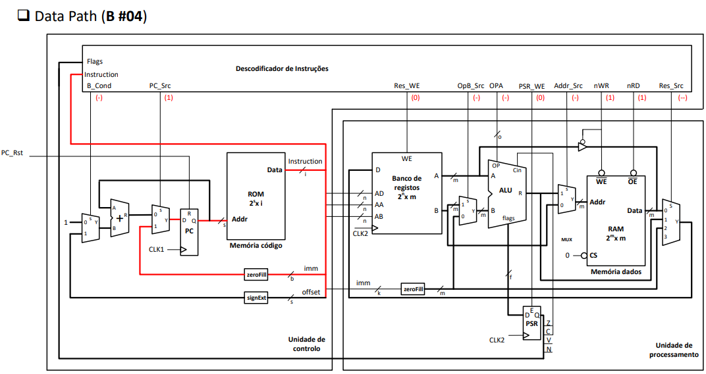

# Processor Internal Organization

## Processing Unit

### Arithmetic and Logic Unit - ALU

**P16 Processor**

- Can do 12 microoperations:

  - 4 arithmetic operations (addition and subtraction with or without carry)

  - 4 logic operations (complement - NOT, conjunction - AND, disjunction - OR and exclusive disjunction - XOR)

  - 4 shifting operations (shifts and rotations for both ways) 

- Accepts 2 16-bit encoded operands
- Accepts a carry bit as a third operand for arithmetic operations
- Produces a 16-bit encoded result
- Generates 4 state bits:
  - Zero
  - Carry
  - Signal
  - oVerflow

### Register File

**P16 Processor**

- Register file with 16, 16-bit, registers
- One input port for writing (DestData)
-  Three output ports for reading (A, B and Sc)
- Three control signals for specifying the target registers of operations:
  - addrA, addrB e addrSD specify the registers whose values will be made available at ports A, B and Sc
  - addrSD is also used to specify the target register to write
- A control sign (RFC) to enable writing to the registry specified by addrS

## Control Unit

The control unit is responsible for the management of the processor operation:

- Generate the control word/sequence of words that define the desired functionality for each statement;
- Interaction with main memory and peripherals.

These control words define, among other things, the operations to be carried out by the ALU, the registers and constants that serve as operands, the data forwarding signals, etc.

Through the state bits that it receives from the ALU it is possible to control the execution flow of a program.

The **Program Counter - PC** saves the information relating to the instruction that is being executed in every moment. Since the instructions are stored in memory, this register stores the memory address of the next instruction to be executed. 

The **Instruction Register - IR** stores the code of the instruction that is being executed on the processor at every moment. The contents of this register are used to determine the Microoperation/sequence of microoperations to be executed by the Processing Unit.

## Main Memory

The instructions that make up a program are stored sequentially in memory, thus specifying the sequence of operations to be executed. The data of the program, whether it is the input or the data resulting from its execution, is also stored in memory.

The memory subsystem may include one or more memory circuits, including different features different (e.g. volatile, non-volatile, etc). This subsystem is connected to the processor via three buses:

- Address bus
- Data bus
- Control bus

> The data storage capacity of a memory, in bits, is given by the product **w × b**.
> Normally, p and b are powers of 2. **w** is the number of words and **b** are the bit size of a word. 

### Random Access Memory

**Address Port - A**

- It is used to define the memory position (word) to be accessed
- Input port with dimension *a* bits

**Data Port - B**

- It is used to transport the data to be written/read from memory
- Bidirectional port with dimension *b* bits

**Control Signals**

- **Chip Select (CS)** serves to enable the operation of the circuit
- **Output Enable (OE)** serves to indicate that the operation to be performed is to read data
- **Write Enable (WE)** is used to indicate that the operation to be performed is to write data. This signal has priority over the OE signal!
- Usually, these signals are of the *active-low* type (activated with the logical level 0).

The memory cells are organized in a matrix:

- There is a memory cell in each position of the matrix; Each memory cell holds a bit of a word. 
- The rows in the matrix correspond to the addresses.
- The columns of the array correspond to the bits of the words.

**Comparison with the Register file**

Interface

- A database typically offers 3 one-way ports.
- A SRAM typically only offers a two-way port.

Operation

- A Register file operates synchronously.
- A SRAM has asynchronous operation.

Dimension

- A Register file typically has no more than 128 registers.
- The capacity of a SRAM can be several megabytes (MB).

Hardware Features

- Implementing a SRAM memory cell is less expensive than implementing a flip-flop.
- SRAM's increased capacity comes at the expense of more hardware resources.

Performance

- Register File makes it possible to read/write in a single clock period (T < 1 ns) 
- SRAM's operating rate is much lower than that of the log bank (T > 5 ns)

### Read Only Memory

**Address Port - A**

- It is used to define the memory position (word) to be accessed
- Input port with dimension *a* bits

**Data Port - B**

- It is used to transport the data to be written/read from memory
- Bidirectional port with dimension *d* bits

**Control Signals**

- **Chip Select (CS)** serves to enable the operation of the circuit
- **Output Enable (OE)** serves to indicate that the operation to be performed is to read data
- Usually, these signals are of the *active-low* type (activated with the logical level 0).

## Microarchitecture

Microarchitecture is the name for the circuit that implements the structure of the processor. It should implement the supported instruction set and the architectural state of the processor.

The architectural state of the processor is defined by the current values of:

- Program counter (PC); 
- Status Register(s) (CPRS);
- Register File;
- Stack Pointer (SP).

For the same architecture, there can be several microarchitectures that result from different commitments between:

- Number of clock cycles required to execute the instructions;
- Maximum clock signal frequency to be applied to the microarchitecture; 
- Hardware resources necessary for the physical realization of the microarchitecture; 
- Power consumption and maximum power dissipated

### Harvard - Single-cycled microarchitecture

Makes it possible to execute an instruction in just one clock cycle.

Advantages: 

- Simple control
- No hardware required to store the internal state of the microarchitecture

Disadvantages:

- The clock cycle period is enforced by the execution time of the more complex instruction
- It requires two different memory interfaces to obtain the instruction code in the same clock cycle and read/write the data to memory

- Processing Unit

  

- Control Unit

  

#### Data Path Examples

| **Instruction**     | **Description**                      |
| ------------------- | ------------------------------------ |
| LDR rx, [ry, #imm2] | rx <- MEM[ry+imm2]                   |
| ADD rx, ry, rz      | rx <- ry + rz, Z <- is updated       |
| MOV rx, imm4        | rx <- #imm4                          |
| BZS offset4         | PC <- (Z==1) ? PC + offset4 : PC + 1 |
| B imm7              | PC <- #imm7                          |
| SUB rx, ry, #imm2   | rx <- ry - #imm2, Z <- is updated    |
| STR rx, [ry]        | MEM[ry] <- rx                        |

Instructions encoding

- **MOV r0, #0**

- **STR r1, [r2]**

- **LDR r1, [r2, #3]**

- **ADD r1, r2, r3**

- **SUB r1, r2, #3**

- **BZS #+16 (Z==0 vs Z==1)**

- **B #4**

**Instructions Decoder**

### Von Neumann - Multi-cycle Architecture

Instruction performed in multiple clock cycles, enforced by the fastest instruction. Slower instructions "spend" more clock cycles.

Advantages:

- Improved performance
- Takes advantage of faster instructions
- Resource sharing (hardware)
- Use of a single memory to store code and data

Disadvantages:

- Increased complexity
  - Control unit 
  - Datapath

#### Data Path Examples

| **Instruction**     | **Description**                      |
| ------------------- | ------------------------------------ |
| LDR rx, [ry, #imm2] | rx <- MEM[ry+imm2]                   |
| ADD rx, ry, rz      | rx <- ry + rz, Z <- is updated       |
| MOV rx, imm4        | rx <- #imm4                          |
| BZS offset4         | PC <- (Z==1) ? PC + offset4 : PC + 1 |
| B imm7              | PC <- #imm7                          |
| SUB rx, ry, #imm2   | rx <- ry - #imm2, Z <- is updated    |
| STR rx, [ry]        | MEM[ry] <- rx                        |

- **Add rx, ry, rz**

​	

- **bzs offset**

  

- **ldr rx, [ry, #imm4]**

  

​	

#### von Neumann vs. Harvard

| von Neumann                 | Harvard                        |
| --------------------------- | ------------------------------ |
| Single data and code memory | Separated data and code memory |
| Multi-cycle                 | Single cycle                   |
| Single bus                  | Independent buses              |

