# Memory Subsystem

## Bus connections

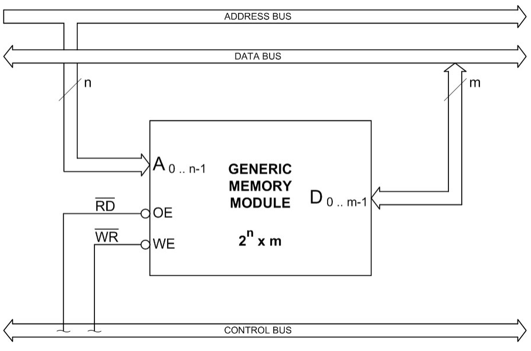

## Sizing - Data Dimension

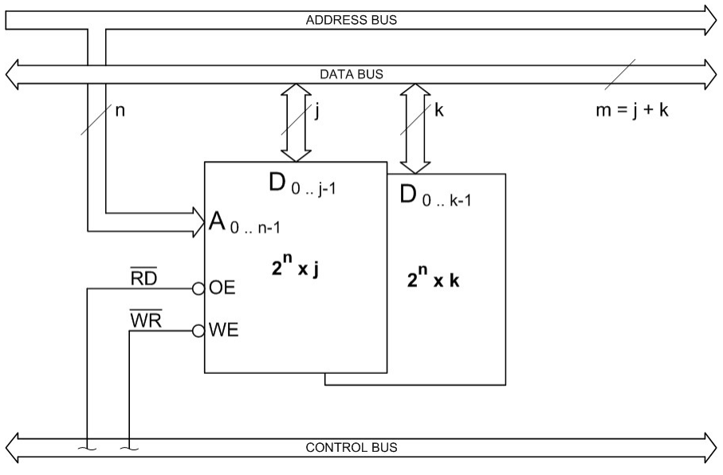

## Granularity - Number of addresses

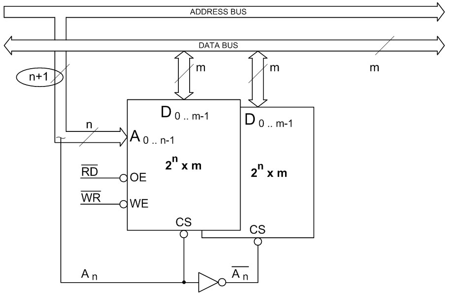

## Mapping

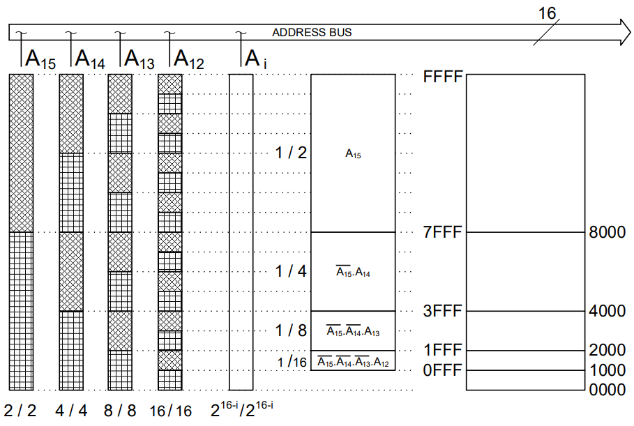

## Double Granularity

## Decoding Modes

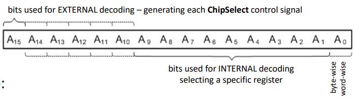

For each module we can have:

- **Full decoding** – all address bits are processed – the bits that do not participate in the internal decoding,
  participate "without exception" in the definition of the respective **ChipSelect**
- **Incomplete decoding** – some address bits are ignored – bits that do not participate, either in the internal decoding or in the definition of the respective **ChipSelect**, result in **foldback** (each internal register corresponds to several "synonymous" addresses).
- **Underutilization** – some internal addresses are inaccessible – the portion of addresses assigned to a given module is smaller than its size (i.e. that some bits "participate simultaneously" in both decodes)

### Full decoding

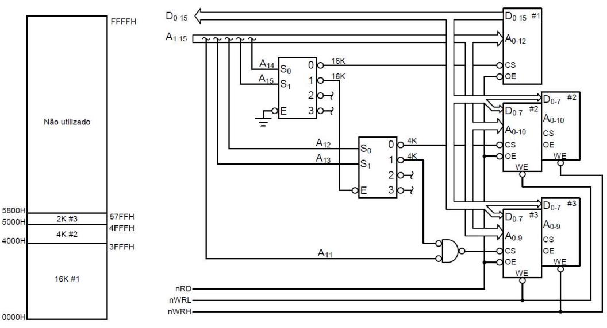

### Incomplete decoding - Memory foldback

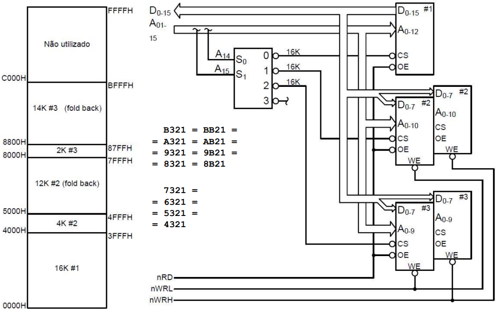

### Linear selection

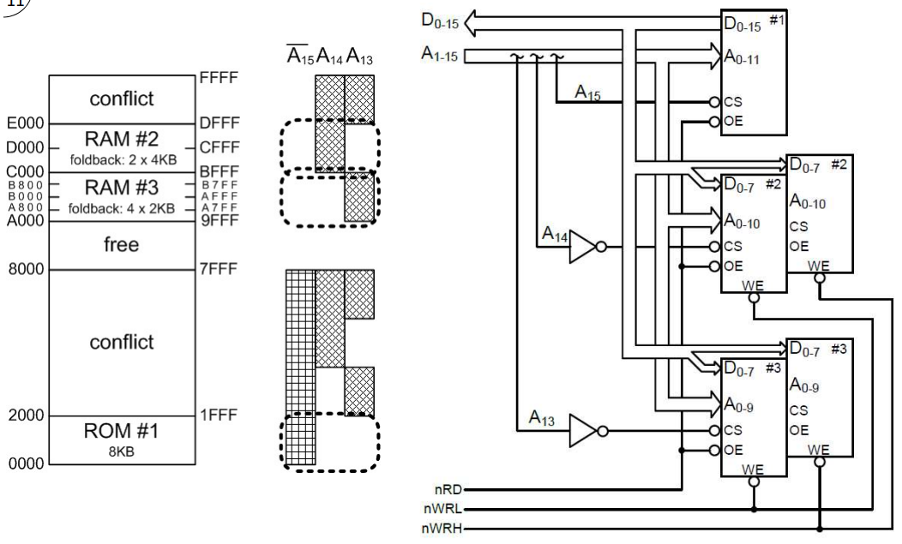

## Modularity

### With the double word

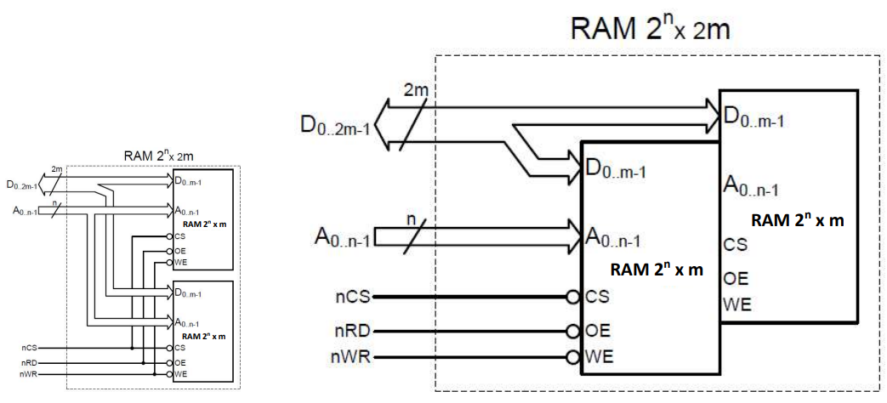

### With twice as many addresses

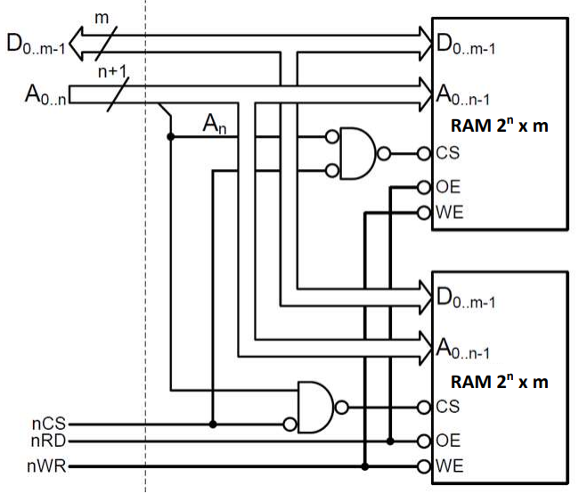

## The case of the SDP16 Teaching System

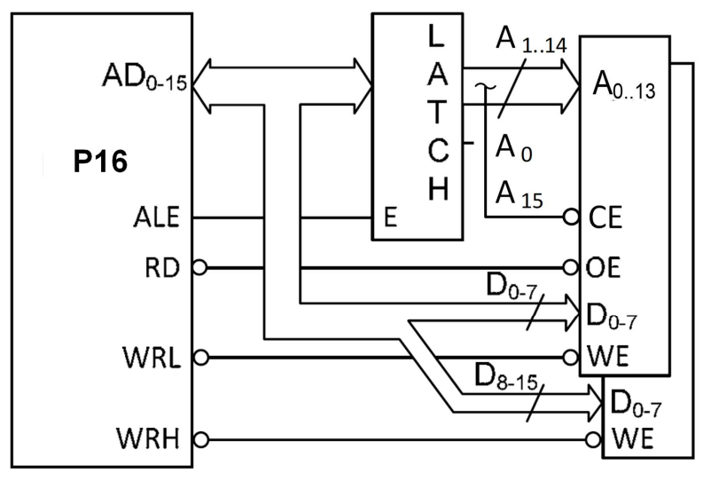