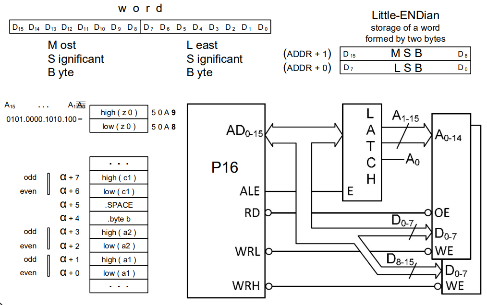

# Memory Subsystem

## Bus connections


## Sizing - Data Dimension


## Granularity - Number of addresses


## Mapping


## Double Granularity



## Decoding Modes


For each module we can have:

- **Full decoding** – all address bits are processed – the bits that do not participate in the internal decoding,
  participate "without exception" in the definition of the respective **ChipSelect**
- **Incomplete decoding** – some address bits are ignored – bits that do not participate, either in the internal decoding or in the definition of the respective **ChipSelect**, result in **foldback** (each internal register corresponds to several "synonymous" addresses).
- **Underutilization** – some internal addresses are inaccessible – the portion of addresses assigned to a given module is smaller than its size (i.e. that some bits "participate simultaneously" in both decodes)

### Full decoding


### Incomplete decoding - Memory foldback


### Linear selection


## Modularity

### With the double word


### With twice as many addresses


## The case of the SDP16 Teaching System


## Mapping memory with most significant address bits


## Relation between word size and memory capacity

| Word size | Memory capacity |
| --------- | --------------- |
| 16        | 64 k            |
| 15        | 32 k            |
| 14        | 16 k            |
| 13        | 8 k             |
| 12        | 4 k             |
| 11        | 2 k             |
| 10        | 1 k             |
| 9         | 512 b           |
| 8         | 256 b           |


## Example exercises


### #1

- Type: ROM (Doesn't have a WE)
- Dimensions:
  - Lines: 2K (A0..10)
  - Columns: 16 (D0..15)
- Organization: 2K x 16 (word = 2 Bytes)
- Capacity in Bytes: 2K x 16 = 4KB

### #2 and #3

- Type: RAM (Has a WE)
- Dimensions:
  - Lines: 8K (A0..12)
  - Columns: 8 (D0..7)
- Organization: 8K x 8 (Byte)
- Capacity in Bytes: 2 (units) x 8KB = 16KB

###  #4 and #5

- Type: RAM (has WE)
- Dimensions:
  - Lines: 2K (A0..10)
  - Columns: 8 (D0..7)
- Organization: 2K x 8 (1 Byte)
- Capacity in bytes: 2 (units) x 2 K = 4KB / for a single unit, it has 2K x 8 = 2KB

### Address Map


To correct the address map we can use:


> To simulate a program using this mapping in the **p16sim**, we need to create a .txt file with the mapping and then use the  **-c** flag.
>
> **p16sim.exe -c ac_tp06_p16sim_config.txt**
>
> To change the location of the tags **.text** and **.data** in the assembler (**p16as**), we need to use the **-s** flag followed by the tag, followed by address.
>
> **p16as.exe -s .text =0x6100 -s .data =0x4020 ac_tp06.S**


Example of a custom address mapping text file for the **p16sim**

```txt
p16
rom
id=1
databus=P16
addrbits=11
addrsel=8000,8FFF
ram
id=2
databus=P16Low
addrbits=13
addrsel=6000,7FFF
ram
id=3
databus=P16High
addrbits=13
addrsel=6000,7FFF
ram
id=4
databus=P16Low
addrbits=11
addrsel=0000,0FFF
addrsel=4000,4FFF
addrsel=8000,8FFF
addrsel=C000,CFFF
ram
id=5
databus=P16High
addrbits=11
addrsel=0000,0FFF
addrsel=4000,4FFF
addrsel=8000,8FFF
addrsel=C000,CFFF
```

 
