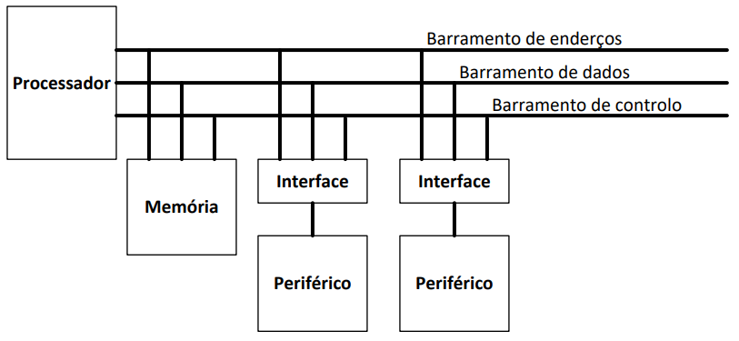
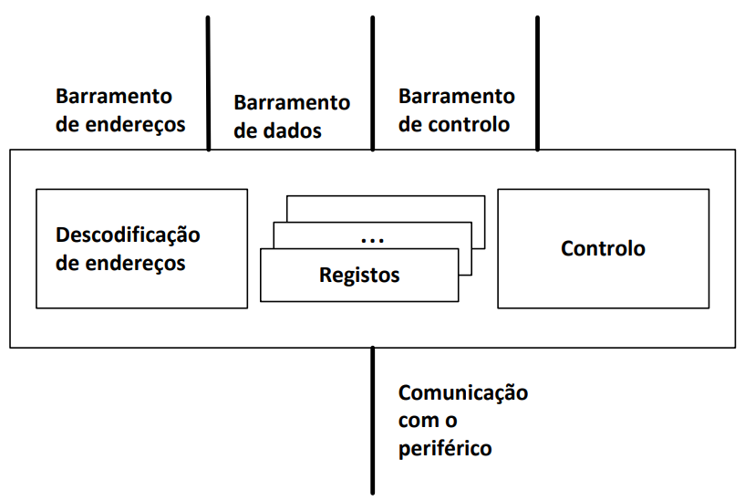
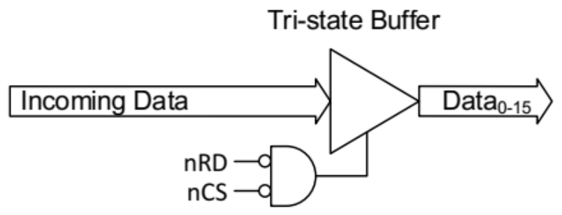
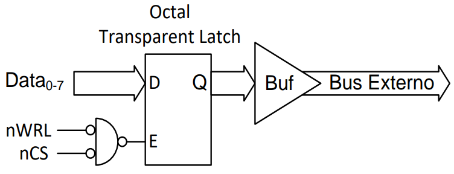

# Input and Output Subsystem

The I/O subsystem supports communication with the devices outside the computer.

It allows you to obtain the data to be processed and to make the results of that processing available.

Usually, access to peripheral devices is done in a similar way to memory. This interaction involves the use of protocols, which are a set of rules that allow the correct transfer of data between the processor and a given peripheral


## Addressing types

### Port-based IO

- Use separate buses (and therefore address spaces) for the I/O and memory subsystems;
- Ensures no conflicts in access to peripherals and memory;
- Allows you to increase the performance of the system, as it is possible to parallelize accesses to memory and peripherals;
- Increases the complexity of the system, not only because of the existence of several buses and external interfaces, but also because of the complexity of the control.

### Independent IO

- Use the same bus but different address spaces for the I/O and memory subsystems;
- ISA is more complex as it has to include specific instructions to support data exchanges with ports
- The control bus contains information about the type of address of the transaction in progress (memory or port)

### Memory mapped IO

- Use the same bus and address space for the I/O and memory subsystems;
- Less complexity of the system, including its control
- Data exchanges with ports use the same instructions as data exchanges with memory
- Reduced address space available for memory as there are reserved addresses for access to I/O ports

## Interfaces

The connection of a peripheral to the processor bus is usually provided by a module called an interface. Depending on the peripheral, this module can be more or less complex. The basic idea is that the interface isolates the operation of the processor from the particularities of the peripherals.



### Functionalities

- It promotes the necessary adaptations from a physical point of view (e.g. adaptation of voltage and electric currents);
- Decodes the addresses present on the bus, to identify the transfers that involve the peripheral;
- Promotes the adaptation of operating rhythms between the processor and the peripheral;
- Controls the operation of the peripheral, in cases where it supports different modes 
  operation;
- Supports exploitation of the processor interrupt mechanism;
- Allows peripherals to participate in data transfer modes with reduced processor involvement (e.g. direct memory access)

### Architecture



- The registers are used by the processor to write and/or read the data it wants to send and/or 
  receive from the peripheral.
- Writing/reading is done in parallel and at the pace of the processor.
- The type of data transferred defines the type of port:
  - Data port - Input or output port that supports data exchanges between the processor and peripheral;
  - Control Port - Input port where the processor writes control data to define the operation of the peripheral or data transfers;
  - Status port - Input port where the processor reads data regarding the current state of the peripheral.
- The address decoder is responsible for identifying, on the address bus, the addresses corresponding to the interface registers, enabling operations on these ports.
- Typically, the addressing of a peripheral is a function divided between two blocks:
  - Decoding block external to the interface;
    - Intended to enable the operation of an interface for a given range of addresses.
    - Often shared with memory decoding.
  - Built-in decoding block of the interface itself;
    - Intended to address peripheral ports.
    - In practice, it only decodes the least significant bits of the address, in the number necessary to address all the ports of the peripheral.
- The control unit is responsible for coordinating the operations performed by the interface, including managing communication with the peripheral.
- It may involve the interrupt mechanism or direct memory access (DMA).

## Parallel Input Port

A parallel input port consists of a TRISTAT buffer which, when addressed by the CPU, places the information present in the input pins of the port at low impedance on the CPU data bus. As an example, the basic structure of a 16-bit parallel input port is presented.



Example of a assembly code to read from an input port

```assembly
.equ INPORT_ADDRESS, 0xFFC0

...

inport_read:
	mov  r1, #INPORT_ADDRESS & 0xFF
	movt r1, #INPORT_ADDRESS >> 8 & 0xFF
	ldr  r0, [r1, #0]
	mov  pc, lr
```


## Parallel Output Port

An output parallel port is a register inserted into the CPU address space into which a word can be typed. 
The word written in the register is available in pins through an output stage, which gives it an impedance capable of interconnecting the CPU with the most common digital logic circuits (e.g. TTL) as well as other types of electronics. As an example, the characteristic structure of an 8-bit output port is presented. The registry may have a latch or edge-triggered, as long as the memorization takes place in a moment when the data on the bus is stable



Example of a assembly code to write to an output port

```assembly
.equ OUTPORT_ADDRESS 0xFF80

...

outport_write:
	mov  r1, #OUTPORT_ADDRESS & 0xFF
	movt r1, #OUTPORT_ADDRESS >> 8 & 0xFF
	str  r0, [r1, #0]
	mov  pc, lr
```

### Development of the Output Port Peripheral Manager

We will need 4 functions / routines:

- ```void outport_set_bits ( uint8_t pins_mask );``` which assigns the logical value **one** to the output port pins identified with the value one in **pins_mask**. The value of the remaining bits does not change.
- ```void outport_clear_bits ( uint8_t pins_mask );``` which assigns the logical value **zero** to the output port pins identified with the value one in **pins_mask**. The value of the remaining bits does not change.
- ```void outport_write_bits ( uint8_t pins_mask, uint8_t value );``` which assigns to the output port bits identified with the logical value one in **pins_mask** the value of the corresponding bits in **value**. The value of the remaining bits does not change.
- ```void outport_init( uint8_t value );``` that does the port initialization, assigning the value value to its bits.
- ```void outport_write ( uint8_t value )``` that writes the value in the outport and in the memory to keep the last value written to the port

#### Outport Set Bits

```assembly
;---------------------------------------------------------------------------------
; Rotina: outport_set_bits
; Descricao: Atribui o valor logico um aos pinos do porto de saida identificados 
; com o valor um em pins_mask. O estado dos restantes bits nao e alterado.
; Entradas: Mascara com os bits a alterar
; Saidas: 
; Efeitos: Atualiza o valor da variavel imagem do porto
;---------------------------------------------------------------------------------
outport_set_bits:
	push lr
	ldr  r1, outport_img_address
	ldrb r2, [r1, #0]
	orr  r0, r2, r0 ; outport_img |= pins_mask
	bl   outport_write
	pop  pc
```

#### Outport Clear Bits

```assembly
;---------------------------------------------------------------------------------
; Rotina: outport_clear_bits
; Descricao: Atribui o valor logico zero aos pinos do porto de saida identificados 
; com o valor um em pins_mask. O estado dos restantes bits nao e alterado.
; Entradas: Mascara com os bits a alterar
; Saidas: 
; Efeitos: Atualiza o valor da variavel imagem do porto
;---------------------------------------------------------------------------------
outport_clear_bits:
	push lr
	ldr  r1, outport_img_address
	ldrb r2, [r1, #0]
	mvn  r0, r0
	and  r0, r2, r0
	bl   outport_write
	pop  pc
```

#### Outport Write Bits

```assembly
;---------------------------------------------------------------------------------
; Rotina: outport_write_bits
; Descricao: Atribui aos pinos do porto de saida identificados com o valor lógico
; um em pins_mask o valor dos bits correspondentes de value. O estado 
; dos restantes bits nao e alterado.
; Entradas: Mascara com os bits a alterar
; : Valor com os bits a alterar
; Saidas: 
; Efeitos: Atualiza o valor da variavel imagem do porto
;---------------------------------------------------------------------------------
outport_write_bits:
	push lr
	and  r1, r0, r1 ; r1 = pins_mask & value
	ldr  r2, outport_img_address
	ldrb r3, [r2, #0]
	mvn  r0, r0 ; ~pins_mask
	and  r3, r3, r0 ; outport_img &= ~pins_mask;
	orr  r0, r3, r1 ; outport_img |= pins_mask & value;
	bl   outport_write
	pop  pc
```

#### Outport Init

```assembly
;---------------------------------------------------------------------------------
; Rotina: outport_init
; Descricao: Faz a iniciacao do sistema, atribuindo o valor value aos pinos do
; porto de saida .
; Entradas: Valor a escrever no porto
; Saidas:
; Efeitos: 
;---------------------------------------------------------------------------------
outport_init:
	push lr
	bl   outport_write
	pop  pc
```

#### Outport Write (and saves copy)

```assembly
.equ OUTPORT_ADDRESS, 0xF800

;---------------------------------------------------------------------------------
; Rotina: outport_write
; Descricao: Escreve no porto de saída o valor dos bits correspondentes de value.
; Entradas: Valor a escrever no porto
; Saidas:
; Efeitos: 
;---------------------------------------------------------------------------------
outport_write:
	ldr  r1, outport_img_address
	strb r0, [r1, #0]
	mov  r1, #OUTPORT_ADDRESS & 0xFF
	mov  r1, #OUTPORT_ADDRESS>>8 & 0xFF
	strb r0, [r1, #0]
	mov  pc, lr
	
outport_img_address:
	.word outport_img
	
	...
	
	.data
outport_img:
	.space 1
```

