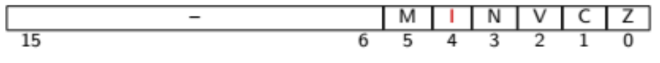

# Interrupts Mechanism

To address the necessity for a program to access data from a peripheral, the processor has one or more input entries to receive interrupt requests. The processor tests the state of these inputs after completing the execution of an instruction. If any input is active, the processor generates a call to the responsible routine for handling the event that generated the outage request. When the routine returns, the program resumes its execution at the point where it was interrupted.

## Implications in the architecture and the microarchitecture

- Additional External Inputs
- Control over the inhibition and permission of interruptions
- In-memory location of the routine responsible for handling interrupt requests
- Automatic preservation of program execution state
- Return to normal mode

> The routine responsible for handling interrupt requests is usually called **ISR**, which stands for **Interrupt Service Routine**.


### Additional External Inputs

The external inputs are usually referred to as **IRQ**, which stands for **Interrupt ReQuest**. As for their nature of excitement, they can be: **Edge-triggered** or **Level-triggered**.

> Interrupt inputs that are level-sensitive in nature should be used by peripherals that have the ability to withdraw the interrupt request when they are accessed by the ISR.

### Control of interruption attendance

The operation of the interrupt mechanism can be enabled or disabled on a per-program basis: 

- Changing the value of a bit in a control register;
- Executing a processor-specific instruction. 

On some processors, it is also possible to inhibit/allow specific external input interrupts to be attended using the same techniques (maskable interrupts).

After the system starts, interrupt handling is disabled.

When the processor handles an interrupt, it inhibits the handling of new interrupts.

### ISR In-Memory Location

The memory address where the interrupt address vector (ISR) is located can be defined using three different techniques:

- Fixed Address (P16 case)
- Interrupt vectorization - The location of the ISR is provided by the peripheral on the processor data bus.
- Interrupt vector table
  - The processor includes an in-memory table with the addresses of the ISRs;
  - The processor obtains from the peripheral the index of the table corresponding to its ISR;
  - The index can be obtained by reading a record from the peripheral or by querying the data bus.

### Preservation of program execution status

Before responding to an interrupt request, the processor must save the current state of the running program. E.g.: The current value of the PC, the processor state register, and other specified register. Usually, is used the same mechanism for calling subroutines, Stack utilization and use of additional registers (e.g. link register, extra state register, etc).

> It is the developer's responsibility to ensure that the state of all records that are not automatically handled by the processor's interrupt mechanism are preserved.

For example, the P16 processor provides the programmer with a total of 19 registers, all 16-bit: 

- 16 general purpose registers (R0 to R14); 
- The Program Counter (PC), mapped in the R15 register;
- 2 processor status registers (CPSR and SPSR).

At any given time, only 15 general-purpose registers are accessible to the programmer. The registers that can be accessed are defined by the Processor operating mode - **N** normal or **I** interrupt

| N mode   | I mode    |
| -------- | --------- |
| R0       | R0        |
| R1       | R1        |
| R2       | R2        |
| R3       | R3        |
| R4       | R4        |
| R5       | R5        |
| R6       | R6        |
| R7       | R7        |
| R8       | R8        |
| R9       | R9        |
| R10      | R10       |
| R11      | R11       |
| R12      | R12       |
| R13 = SP | R13       |
| R14 = LR | R14 = iLR |
| R15 = PC | R15 = PC  |
| CPSR     | CPSR      |
| SPSR     | SPSR      |

### Return to normal mode from ISR

The return of an SRI is a particular case of routine return:

- Restores the content of the registers safeguarded by the interrupt mechanism;
- Restores the fulfillment status of interrupt requests.

As such, processors include a specific instruction to perform this operation.


## P16 Processor Interrupt System

### External Interrupt Input

The P16 includes only one external interrupt input. This entry is called **nEXTINT**. Is level sensitive and enabled with the logical value zero.

### Inhibition/Permission to Attend Interruptions

Handling of interrupt requests is inhibited/allowed by manipulating the CPSR register. The value of the **I bit** defines whether operation is inhibited (I = 0) or allowed (I = 1). After RESET, the bit I returns to zero.



#### Related instructions:

**MRS Rd, CPSR** (move status to register)

- Copies the contents of the CPSR register to the Rd register. Rd ← CPSR
- Rd specifies the destination register (R0 - R15)
- Doesn't update any state bits in the CPSR

**MSR Rd, SPSR ** (move register to status)

- Copies the contents of the SPSR register to the Rd register. Rd ← SPSR
- Rd specifies the destination register (R0 - R15)
- Doesn't update any state bits in the SPSR

Example of assembly code to enable the Interruptions attend:

```assembly
example1:  
	mov	R0, #0x10
	msr CPSR, R0
	
example2;			; preserving the current CPSR state flags
	mrs	R0, CPSR
	mov R1, #0x10
	orr R0, R0, R1
	msr CPSR, R0
```

### In-Memory location of the ISR

The in-memory location of the ISR is fixed and the interrupt address vector is associated with the **0x0002** address.

This address can be found to be the ISR itself, or an instruction that promotes the jump to the memory zone where the ISR was located.

> Addresses 0x0000 and 0x0002 make up the exception vector table of P16

Assembly examples:

```assembly
; ISR located in the address 0x0002

	.section .startup
	b	_start
isr:
	...
_start:
	ldr	SP, addr_stack_top
	...
	b	.
	
addr_stack_top:
	.word stack_top
```

```assembly
; ISR located in other address than 0x0002

	.section .startup
	b	_start
	ldr	PC, isr_addr
_start:
	ldr SP, addr_stack_top
	...
	b	.
addr_stack_top:
	.word stack_top
isr_addr:
	.word isr
```

### Preservation of program execution status

When responding to an interruption, the P16 performs the following atomic tasks 
operations: - Copies the value from the CPSR registry to the SPSR registry;
- Zeroes out bit I of the CPSR record, inhibiting the fulfillment of other interruption requests;
- Sets the M bit of the CPSR register to one, putting the processor in interrupt mode;
- Copies the PC value to the iLR registry (the iLR registry of the interrupt mode);
- Puts the value two on PC, vectoring the processing to the 0x0002 address that corresponds to the interrupt entry point.

> When in Interruption mode, the P16 has access to a different link register named **iLR**

### Return to Normal Mode

The return of the ISR is done using the **movs PC, LR** statement. This instruction performs two distinct operations in an atomic way, i.e. in the same machine cycle:

- Copies the LR registry value from the interrupt mode to the PC, promoting the return of the routine;
- Copies the value from the SPSR registry to the CPSR registry, resetting the processor status.

> Resetting the CPSR registry value allows you to return to normal operating mode (M = 0) 
> and rehabilitate the service of external interruptions (I = 1)

#### Instruction:

**MOVS PC, LR** (move status)

- Simultaneously copies the contents of the iLR registry (R14) to the PC registry (R15) and the contents of the SPSR registry to the CPSR registry.
  R15 ← R14 and CPSR ← SPSR
- Has no instruction operands, as PC, LR, CPSR, and SPSR are implicit
- Updates all bits in the CPSR. (Z, C, V, N, I and M)

#### Example of ISR

```assembly
isr:
	; Prologue : Stacking the contents of changed records
	; iLR, in case of invoking (in) another routine(s)
	; Use R4 to R12, as stipulated in the other rules of the Convention
	; Use R0 to R3, as the rules of the convention do not take into account these records
	...
	; Epilogue : Resetting the contents of changed records from the stack
	movs PC, LR
```


