# Counters and Timers

## Fundamentals

Typically, the operation of a computer system involves time measurements, either to support the generation of events at specific times or the calculation of time intervals.

Typical usages:

- Interval timers
- Event counters
- [Watchdog timers](https://en.wikipedia.org/wiki/Watchdog_timer)
- Real-Time Clocks (RTC)
- Pulse width modulators
- Baud rate generators
- others...

### Time Measurement by Program vs Use of Counters in Hardware

| Time measured by program                                     | Use of counters in hardware                                  |
| ------------------------------------------------------------ | ------------------------------------------------------------ |
| **+** Software only implementation                           | **+** Applicable to all situations                           |
| **-** Counting accuracy depends on the execution time of the instructions | **+** Reduces software complexity                            |
| **-** Underutilization of processor time                     | **+** Better use of processor time                           |
| **-** Increases software complexity                          | **+** Counting accuracy depends on the characteristics of the peripheral |
| **-** Not feasible for all situations                        | **-** Requires additional hardware                           |

### Counters vs Timers


**Counters** are intended to account for the occurrence of events. Similar mode of operation to the timer mode but more generic, in which the pulses of an aperiodic signal are counted.

Example:
Knowing that the output of a turnstile is applied to the clock input of a and that the current count value of this counter is 2000, it can be inferred that 2000 people have passed through the turnstile since the counter count was restarted.

The use as a **timer** aims to support time measurements, which make it possible to:

- Generate events at specific times;
- Measure time intervals between occurrences of events.
- Time measurement is achieved by counting the pulse of the signal applied to the clock input of the counter, the period of which is fixed and known.

Example:
Knowing that an increasing counter has a periodic signal as its clock signal, with a period value TCLK = 1 ms (frequency 1 kHz), and that its current counting value is ti = 2000, it can be inferred that two seconds have elapsed since the counter count was reset (t0 = 0). **∆t = (ti - t0) × TCLK = 2000ms**

### Terminology

- **Tick** - It is the unit of counting the counter, corresponding in a timer to the smallest measurable time interval.
- **Resolution** - It is the smallest difference between indications that can be significantly distinguished, corresponding in a digital instrument to a unit of the least significant digit. (Can be lower than the ticks)
- **Range** - It refers to the minimum and maximum values that can be measured with a measuring instrument, corresponding to its counting interval on a meter. (Number of output bits)

## Typical architectures

Typically, the architecture of a Timer/event counter is based on:

- a synchronous counter;
- some complementary combinatorial logic;
- a set of parallel ports, for interaction with the processor;
- Interface circuitry for direct input/output of data.

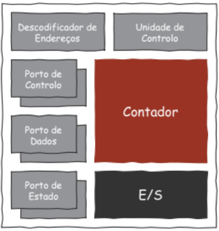

### Up timer

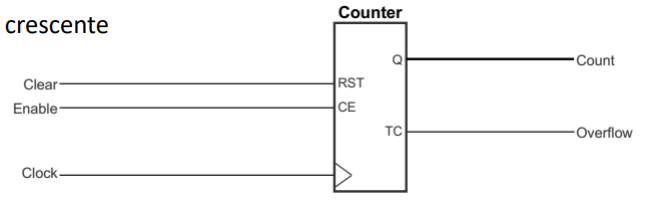

> TC - Terminal Count - is active when the counter reaches it's maximum range.

### Up/Down Timer

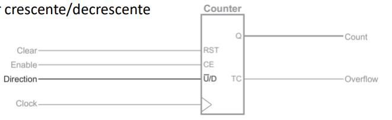

### Up/Down Timer with Parallel Loading

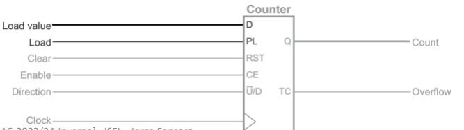

> D - data - value to load to start counting instead of zero
>
> PL - Parallel Load - trigger to read the value passed on D

### Up/Down Timer with Parallel Loading and Count Threshold Programming

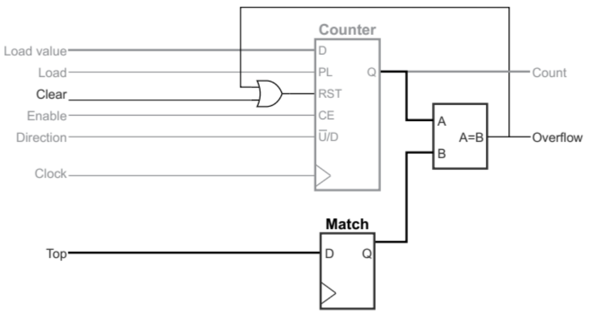

### Timer / Event Counter

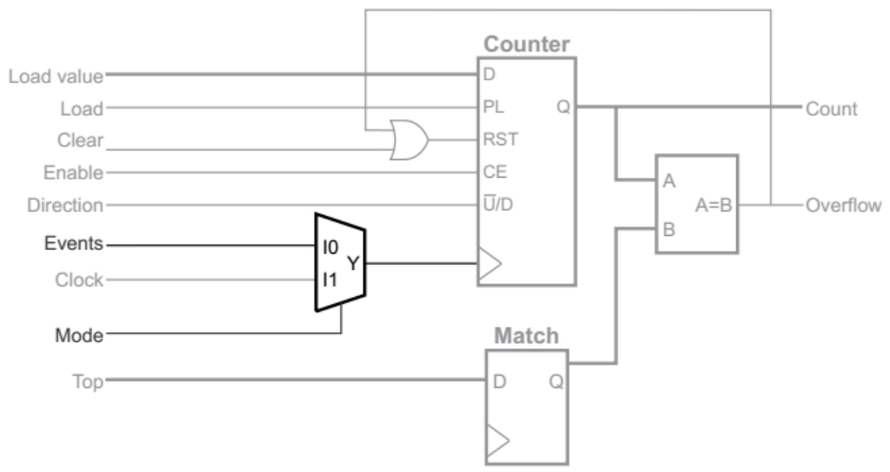

The operation of these peripherals, whether as event counters or timers, is configurable using **control ports**. Examples:

- Setting the operating mode (timer or event counter);
- Counting/inhibiting enablement;
- Counting restart;
- Etc

To exchange data with the peripheral, **data ports** are used. Examples:

- get the current value of the count
- Set the initial value of the count
- Set the threshold value of the count (Match Register)
- etc

In addition, **state ports** are used to provide information about the operation of the peripheral. Examples:

- Current Operation Mode (Timer/Event Counter);
- Counting state (enabled/suspended);
-  Exceeding the counting limit;
- etc.

## Use in computer systems

Typically, the use of a timer/event counter in a computer system involves 4 steps: 

- Mapping in address space
- Definition of the physical connection to the system;
- Establishment of the exploitation mechanism
  - State polling
  - Interruption
- Development of the peripheral manager

##  Pico Timer/Counter (pTC) 

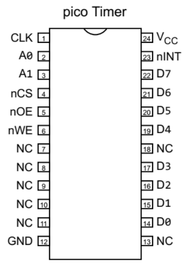

- 8 bit Up Counter
- Main characteristics:
  - Possibility to stop and restart the countdown;
  - Reading of the current value of the count (D) at any time;
  - Provides information on the passage through the counting limit:
    - Definition of the limit value for the count (MATCH);
    - Registered output (nINT). (MATCH reached)
  - Implementation in [PAL ATF750CL](https://www.microchip.com/en-us/product/ATF750CL).

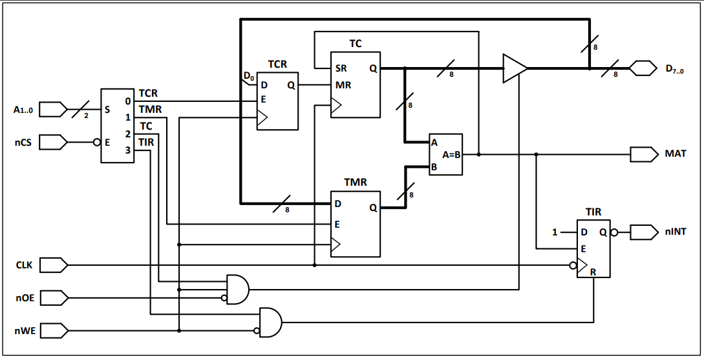

- Consisting of four registers:
  - **TCR** - Timer Control Register (Standing still or counting)
  - **TMR** - Timer Match Register (limit value)
  - **TC** - Timer Counter
    - SR - Synchronous Reset (automatic when the counter reaches MATCH)
    - MR - Master Reset 
  - **TIR** - Timer Interrupt Register (to RESET the flip-flop that requests an interruption)

| Register | Description                                    | Access Mode | Address |
| -------- | ---------------------------------------------- | ----------- | ------- |
| TCR      | Used to control the functioning of the counter | W           | 0       |
| TMR      | Saves the limit value of the count             | W           | 1       |
| TC       | Saves the current value of the count           | R           | 2       |
| TIR      | Signals a request for interruption             | R / W       | 3       |


The Circuit Decoder function of ```A0.. 1``` and ```nCS``` generates four signals: three for write selection and one for read selection.

Structure behavior:

- The *Stop mode* is set to **TCR**. To do this, we have to activate the TCR (0) output of the decoder and set the value 1 to the **DIO<sub>0</sub>** bit to activate the **Master Reset (MR)** input of the Timer/Counter. The Timer/Counter **MR** input is asynchronous in nature.

  ```assembly
  	.equ PTC_ADDRESS, 0x????
  	.equ PTC_TCR, 0
  	.equ PTC_CMD_STOP, 1
  ;-------------------------------------------------------------------------
  ;Funcao para parar a contagem no periferico.
  ;Colocando o contador com o valor zero.
  ;void ptc_stop ( void );
  ;-------------------------------------------------------------------------
  ptc_stop:
  	mov 	R0, #PTC_ADDRESS & 0xFF
  	movt 	R0, #PTC_ADDRESS>>8 & 0xFF
  	mov 	R1, #PTC_CMD_STOP
  	strb 	R1, [ R0, #PTC_TCR ]
  	mov 	PC, LR
  ```

  

- The *limit value* for the count is then set in **TMR**. To do this, we need to activate the TMR output (1) of the decoder and write the value present in **DIO<sub>0..7</sub>** in the TMR register. The value is recorded in the transition from 0 to 1 of the **nWE** signal.

  ```assembly
  	.equ PTC_TMR, 2
  ;----------------------------------------------------------------------------
  ;Programar limite de contagem
  ;R0 = valor limite de contagem
  ;-----------------------------------------------------------------------------
  	mov		R1, #PTC_ADDRESS & 0xFF
  	movt	R1, #PTC_ADDRESS>>8 & 0xFF
  	strb	R0, [ R1, #PTC_TMR ]
  ```

- The *Start mode* of operation is set in **TCR**. To do this, we have to activate the TCR output (0) of the decoder and set the value 0 to the DIO<sub>0</sub> bit to deactivate the **Master Reset (MR)** input of the Timer/Counter.

  ```assembly
  	.equ PTC_CMD_START, 0
  	.equ PTC_TCR, 0
  ;-------------------------------------------------------------------------
  ;Funcao para iniciar a contagem no periferico.
  ;void ptc_start ( void );
  ;-------------------------------------------------------------------------
  ptc_start:
  	mov 	R1, #PTC_CMD_START
  	mov 	R0, #PTC_ADDRESS & 0xFF
  	movt 	R0, #PTC_ADDRESS>>8 & 0xFF
  	strb 	R1, [ R0, #PTC_TCR ]
  	mov 	PC, LR
  ```

- Read the Timer/Counter count value. To do this, we have to activate the output **TC** (2) of the decoder and during the time that the **nOE** signal is active, the tristat is opened so that the value of the counter TC is present in **DIO<sub>0. 7</sub>**

  ```assembly
  	.equ PTC_TC, 4
  ;-------------------------------------------------------------------------
  ;Funcao para devolver o valor corrente da contagem do periferico.
  ;uint8_t ptc_get_value ( void );
  ;-------------------------------------------------------------------------
  ptc_get_value:
  	mov 	R1, #PTC_ADDRESS & 0xFF
  	movt 	R1, #PTC_ADDRESS>>8 & 0xFF
  	ldrb 	R0, [ R1, #PTC_TC ]
  	mov 	PC, LR
  ```

- Once the counting limit is reached, the **MAT** (Match) signal is active, and a **Synchronous Reset (SR)** is performed on the **Timer/Counter (TC)** which continues the count from the zero value, and the fact is marked on the **TIR (Timer Interrupt Register)** flip-flop. Since the SR signal is synchronous with the CLK, it is only at the clock after the count limit is reached that the TC value is set to 0.

- The information that the meter has passed the limit is available in **TINT (Timer Interrupt)**. The TIR record is zeroed out by software by writing the TIR record (any value / any writing).

  ```assembly
  	.equ PTC_TIR, 6
  ;-------------------------------------------------------------------------
  ;Funcao que estabelece o valor zero no Timer Interrupt Register (TIR)
  ;do periferico.
  ;void ptc_clr_int ( void );
  ;-------------------------------------------------------------------------
  ptc_clr_int:
  	; clear Interrupt Request
  	mov 	R0, #PTC_ADDRESS & 0xFF
  	movt 	R0, #PTC_ADDRESS>>8 & 0xFF
  	strb 	R0, [ R0, #PTC_TIR ]
  	mov 	PC, LR
  ```

  ### Time diagram for a count that reaches the threshold value programmed in **TMR**

  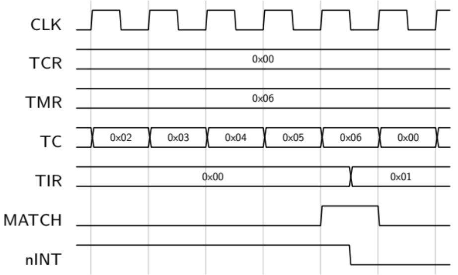

### Time diagram for reading **CT** data

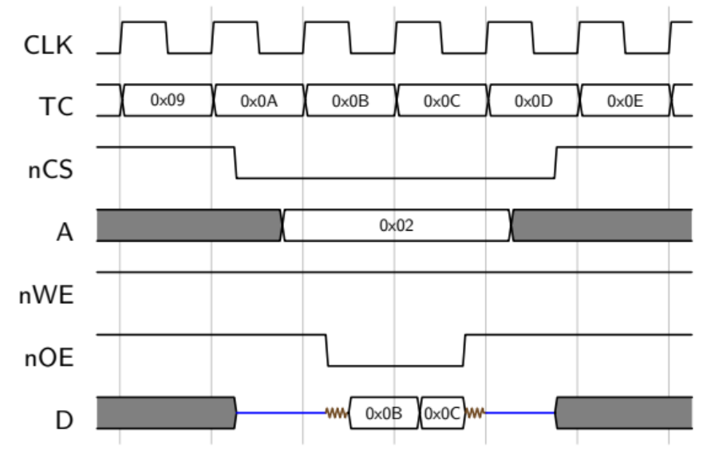

### Interrupt Shutdown Time Diagram

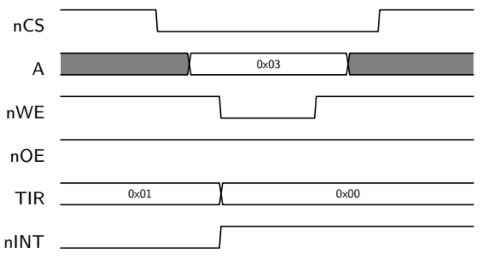

### Time diagram for programming a new value in **TMR**

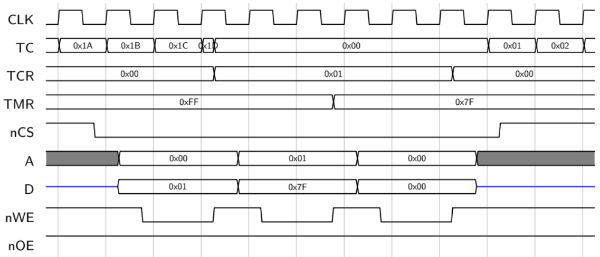
