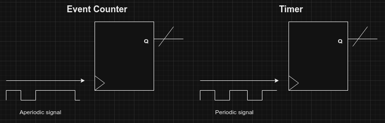

# Counters and Timers

## Fundamentals

Typically, the operation of a computer system involves time measurements, either to support the generation of events at specific times or the calculation of time intervals.

Typical usages:

- Interval timers
- Event counters
- [Watchdog timers](https://en.wikipedia.org/wiki/Watchdog_timer)
- Real-Time Clocks (RTC)
- Pulse width modulators
- Baud rate generators
- others...

### Time Measurement by Program vs Use of Counters in Hardware

| Time measured by program                                     | Use of counters in hardware                                  |
| ------------------------------------------------------------ | ------------------------------------------------------------ |
| **+** Software only implementation                           | **+** Applicable to all situations                           |
| **-** Counting accuracy depends on the execution time of the instructions | **+** Reduces software complexity                            |
| **-** Underutilization of processor time                     | **+** Better use of processor time                           |
| **-** Increases software complexity                          | **+** Counting accuracy depends on the characteristics of the peripheral |
| **-** Not feasible for all situations                        | **-** Requires additional hardware                           |

### Counters vs Timers

**Counters** are intended to account for the occurrence of events. Similar mode of operation to the timer mode but more generic, in which the pulses of an aperiodic signal are counted.

Example:
Knowing that the output of a turnstile is applied to the clock input of a and that the current count value of this counter is 2000, it can be inferred that 2000 people have passed through the turnstile since the counter count was restarted.

The use as a **timer** aims to support time measurements, which make it possible to:

- Generate events at specific times;
- Measure time intervals between occurrences of events.
- Time measurement is achieved by counting the pulse of the signal applied to the clock input of the counter, the period of which is fixed and known.

Example:
Knowing that an increasing counter has a periodic signal as its clock signal, with a period value TCLK = 1 ms (frequency 1 kHz), and that its current counting value is ti = 2000, it can be inferred that two seconds have elapsed since the counter count was reset (t0 = 0). **∆t = (ti - t0) × TCLK = 2000ms**

### Terminology

- **Tick** - It is the unit of counting the counter, corresponding in a timer to the smallest measurable time interval.
- **Resolution** - It is the smallest difference between indications that can be significantly distinguished, corresponding in a digital instrument to a unit of the least significant digit. (Can be lower than the ticks)
- **Range** - It refers to the minimum and maximum values that can be measured with a measuring instrument, corresponding to its counting interval on a meter. (Number of output bits)

## Typical architectures

Typically, the architecture of a Timer/event counter is based on:

- a synchronous counter;
- some complementary combinatorial logic;
- a set of parallel ports, for interaction with the processor;
- Interface circuitry for direct input/output of data.

