# P16 Processor


## Overview

16-bit RISC-type processor with load/store architecture

16 general-purpose records;

43 instructions organized into three classes:

- Data Manipulation Instructions

- Jumping Instructions

- Data Transfer Instructions


Supports the implementation of subroutines;

Support for the implementation of data stack structure;

64 KB memory space, 16-bit or 8-bit accessible;

Support for processing external interrupts.


## Operating modes

The P16 processor supports two distinct operating modes:

- **Normal Mode (N)**, used for normal program execution;

- **Interrupt Mode (I)**, used to process external interrupt requests.

Both modes provide access to all system resources and allow you to switch mode of operation.
The change of operating mode can be done by software or result from an exception:

- Reset;
- Interrupt Request (IRQ)

## Registers

The P16 processor provides the programmer with a total of 19 registers, all 16-bit:
- 16 general-purpose records;
-  2 processor status records (CPSR and SPSR).

The records that can be accessed are defined by the Processor operating mode

### General use registers

The 16 general-purpose records are divided into two blocks of 8 records:
- The low block contains records R0 to R7;
- The high block contains records R8 through R15.

The low block registers are of generic use and accessible by any instruction that have a record as either a source or destination operand.
High block registers cannot be used as the first source operand of the Instructions.
Some registers of the high block are in generic use - R9 to R12, but three are committed tospecific functionalities: R13, R14, R15

### Special use register

- **R15** - maps the **Program Counter (PC)**, saving, at all times, the address of memory where the code of the next instruction to be executed is
- **R14** - is used as a **Link Register (LR)** to store the return address in calls to subroutines or on the input in Break mode.
- **R13** -  is used as a **Stack Pointer (SP)** for stack manipulation instructions.

### Processor state registers

The P16 processor has two status records:
- **Current Processor Status Register (CPSR)**, which stores the current state of the processor;
- **Saved Processor Status Register (SPSR)**, to save the CPSR value at the moment 
immediately prior to entering Interrupt mode.

**CPSR** and **SPSR** are accessible in both operating modes, but using its own instructions.

Both are 16-bit registers, where only bits 0 through 5 have meaning:

|      |      |      |      |      |      |      |      |      |      | M    | I    | N    | V    | C    | Z    |
| ---- | ---- | ---- | ---- | ---- | ---- | ---- | ---- | ---- | ---- | ---- | ---- | ---- | ---- | ---- | ---- |
| 15   |      |      |      |      |      |      |      |      | 6    | 5    | 4    | 3    | 2    | 1    | 0    |

Meaning of CPSR/SPSR bits:

- **Z** - takes the value ```one``` when the value resulting from performing a logical operation or arithmetic is zero;
- **C** - takes the value ```one``` when performing an arithmetic operation results transport to the most significant digit, or in the operations of displacement o last bit shifted is 1;
- **V** - takes the value ```one``` when, when performing a subtraction or a sum, the result exceeds the domain, understood as integers with a code sign of the add-ons for two;
- **N** - takes the logical value of the highest weight bit of the result after performing a arithmetic or logical operation;
- **I** - enables the handling of external interruptions;
- **M** - sets the operating mode of the processor

## Instruction set

The P16 processor instruction set comprises 43 distinct instructions.

The instructions are organized into 3 classes:

- Data processing instructions;

- Control instructions;

- Data transfer instructions.

The data processing instructions adopt a format with three operands.
All instructions are encoded with 16 bits.


### Data processing instructions

The data processing instructions perform operations involving the registers of general and constant use.
There are six subclasses of data processing instructions:

- Arithmetic instructions (add, sub, adc, sbc);
- Comparison instructions (cmp);
- Constant loading instructions (mov, movt);
- Instructions for copying data between registers (mov, movn);
- Logical instructions (and, orr, eor);
- Shifting instructions(lsl, lsr, asr, ror, rol, rrx, rlx).

Most data processing instructions also update the bits of status in the CPSR, depending on the calculated result.

```assembly
; ARITMETHIC INSTRUCTIONS ------------------
ADD R3, R5, #1 		;R3 = R5 + 1
ADD R5, R4, R3 		;R5 = R4 + R3
SUB R3, R5, #1 		;R3 = R5 - 1
SUB R5, R4, R3 		;R5 = R4 - R3
ADC R5, R5, R2 		;R5 = R5 + R2 + C
SBC R5, R4, R3 		;R5 = R4 – R3 - C

; COMPARISON INSTRUCTION -------------------
CMP R4, R5 			;CPSR = R4 - R5

; CONSTANT LOADING INSTRUCTIONS ------------
MOV R0, #255		;R3 = 0x00FF 
MOVT R0, #255		;R3 = OxFFFF

; INSTRUCTIONS FOR COPYING BETWEEN REGISTERS
MOV R0, R1			;R3 = R1
MOVN R0, R1			;R3 = ~R1

; LOGICAL INSTRUCTIONS ---------------------
AND R3, R5, R1 		;R3 = R5 & R1
ORR R5, R4, R3 		;R5 = R4 | R3
EOR R3, R5, R1 		;R3 = R5 ^ R1

; SHIFTING INSTRUCTIONS --------------------
LSL R5, R2, #5 		; R5 = R2 << 5
LSR R5, R4, #4 		; R5 = R4 >> 4
ASR R4, R2, #10 	; 
ROR R6, R4, #5 		; R6 = R4 RIGHT ROTATE 4, 0208 -> 8020
ROR R6, R4, #16-4 	; R6 = R4 LEFT ROTATE 4, 8020 -> 0208
RRX R5, R4 			; R5(15)=Cy, R5(14..0)=R4(15..1), Cy=R4(0)
```


### Control instructions

The control instructions allow you to change the execution flow of the programs by changing the CP value.
Typically, there are three types of control instructions:

- Unconditional jumping (b);
- Conditional jump (beq/bzs, bne/bzc, blo/bcc, bhs/bcs, bge, blt);
- Jump with linkage.

On the P16, all jump instructions set the jump address relative to the PC, this allows space saving when coding instructions and also allows programs to be relocatable.
The value to add to the PC is specified using a constant, encoded with 11 bits using the add-on code. 

> The range of jumps is limited to the range [-512; +511] instructions.

#### For natural numbers

| Testing condition   | Comparison instruction | Jump instruction |
| ------------------- | ---------------------- | ---------------- |
| ```if ( a == b )``` | ```CMP R0, R1```       | ```BNE if_end``` |
| ```if ( a != b )``` | ```CMP R0, R1```       | ```BEQ if_end``` |
| ```if ( a < b )```  | ```CMP R0, R1```       | ```BHS if_end``` |
| ```if ( a <= b )``` | ```CMP R1, R0```       | ```BLO if_end``` |
| ```if ( a > b )```  | ```CMP R1, R0```       | ```BHS if_end``` |
| ```if ( a >= b )``` | ```CMP R0, R1```       | ```BLO if_end``` |


#### For signal integers

| Testing condition   | Comparison instruction | Jump instruction |
| ------------------- | ---------------------- | ---------------- |
| ```if ( a == b )``` | ```CMP R0, R1```       | ```BNE if_end``` |
| ```if ( a != b )``` | ```CMP R0, R1```       | ```BEQ if_end``` |
| ```if ( a < b )```  | ```CMP R0, R1```       | ```BGE if_end``` |
| ```if ( a <= b )``` | ```CMP R1, R0```       | ```BLT if_end``` |
| ```if ( a > b )```  | ```CMP R1, R0```       | ```BGE if_end``` |
| ```if ( a >= b )``` | ```CMP R0, R1```       | ```BLT if_end``` |


### Data transfer instructions

The address space of the P16 is 64 KB, byte and word addressable (16-bit dimension) with 16-bit word alignment.

Data is organized according to *little-endian* format.

Single address space for code access, data and I/O ports.

The instructions for transferring data with memory are of the register-memory type.

There are two classes of data transfer instructions with memory:

- **Load**, for copying the data contained in memory bins to the register file
- **Store**, for copying the contents of registers in the register file to memory locations.

The P16 supports two addressing modes to set the effective address of the memory position to be accessed:

- **Indexed addressing**
  - The base value can be obtained from a register in the low block of the register file (R0 - R7);
  - The index value can be retrieved from any register in the register file or defined using a constant.
- **Relative addressing**
  - The CP value is used as a baseline;
  - The value of the index is defined by a constant.
  - The constants used as an index are natural numbers


| **Instruction**         | Notes                                                        |
| ----------------------- | ------------------------------------------------------------ |
| ldr Rd, label           | Copies a word from memory to the Rd register. The effective address of the memory accessed is specified by the label symbol with a max distance of +128 Bytes. |
| pop Rd                  | Copies from stack to register Rd                             |
| push Rs                 | Copies to stack the value of register Rd                     |
| ldr Rd, [Rn, \<imm4\>]  | Copies a word from memory to the Rd register. The effective memory address accessed is obtained by adding the value of the constant imm4 (index) to the contents of the Rn register (base) |
| ldrb Rd, [Rn, \<imm3\>] | Copies one byte from memory to the Rd register. The effective address of the memory position is obtained by adding the value of the constant imm3 (index) to the contents of the Rn (base) register. The read value is extended, unsigned, to 16 bits. |
| ldr Rd, [Rn, Rm]        | Copies a word from memory to the Rd register. The effective memory address accessed is obtained by adding the contents of the Rm register (index) to the contents of the Rn register (base). |
| ldrb Rd, [Rn, Rm]       | Copies one byte from memory to the Rd register. The effective address of the memory position is obtained by adding the contents of the Rm register (index) to the contents of the Rn register (base). The read value is extended, unsigned, to 16 bits. |
| str Rs, [Rn, \<imm4\>]  | Copies the contents of the Rs register to a memory location. The actual address of that memory position is obtained by adding the value of an imm4 constant (index) to the contents of the Rn (base) register. |
| strb Rs, [Rn, \<imm3\>] | Copies the least significant byte from the contents of the Rs register to a memory position. The effective address of this memory position is obtained by adding to the value of the register Rd (base) with the constant imm3 (index) multiplied by two. |
| str Rs, [Rn, Rm]        | Copies the contents of the Rs registry to a memory location. The actual address of this memory position is obtained by adding the contents of the Rm register (index) to the contents of the of the Rn register (base) |
| strb Rs, [Rn, Rm]       | Copies the least significant byte from the contents of the Rs register to a memory position. The effective address of this memory position is obtained by summing the contents from the Rm register (index) to the contents of the Rn register (base). |


## Internal Structure

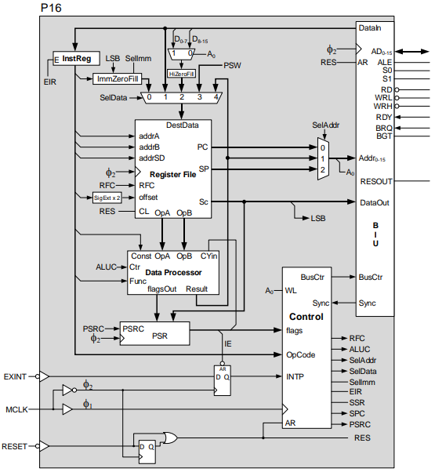

To read a *byte*, a multiplexer has been inserted, which functions from the **A<sub>0</sub>** address bit, selects the high or low part of the *word* read from memory. To allow a *byte* to be written to memory, the control module takes the address bit **A<sub>0</sub>** as input, and if it has a logical value of zero (even address), it activates the **WRL** output signal, otherwise it activates **WRH**.

### Register File

The **P16 Register File** consists of 16 registers (R0 to R15), of 16 bits, allowing instructions to specify up to three registers (three sources or two sources and one destination), thus increasing the versatility of *ISA*.

The address bus **addrDS** (Destination and Source data Address) specifies which record serves as the source for the data bus **Sc**. In order to make the ISA more flexible and standardized, the functional records, such as **PC**, **LINK** and **SP**, were inserted in the *Register File*, corresponding to **R13** to **SP**, **R14** to **LINK** and **R15** to **PC**.

This feature allows you to perform operations on these specific records with the same instructions as you operate on generic records. The action of incrementing and branching the **PC** registry, incrementing and decrementing the **SP** registry, preserving the **LINK** registry, implies that access to the functional registers (**PC**, **LINK**, and **SP**) is done outside the vector structure, making the *Register File* structure slightly more complex.

The **CL** (Clear) entry is activated when the CPU enters a *reset state*, and is intended to set the PC registry to zero.

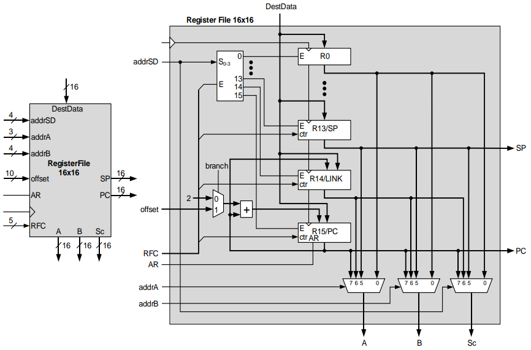

### Data Processor

The **Data Processor** unit of the P16 includes, in addition to the **ALU**, an element for multiplexing and transformation of operand **B**, i.e., sign extension, right-hand padding with zeros, and multiplying by two.

The blocks that perform the operation of multiplication by 2 do not involve the addition of arithmetic elements, since it is a simple displacement of the operand one bit to the left. Since the **Data Processor** unit is also used in the calculation of the address of instructions involving memory access in indexed and indexed-based mode, an intercept logic has been inserted that forces the **ALU** to perform an addition between **A** and **B**, on all instructions that do not belong to the **Data Process** group. The reason **Opb** and **Const4** may have to be multiplied by two is that the access can be either to the *byte* or to the *word*.

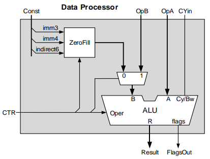

The **ALU** is divided into three functional blocks. The *Arithmetic block* that is responsible for additions and subtractions, the *Logic block* that is responsible for **AND**, **ORR**, **EOR**, and **NOT** operations, and the *Shift block* that performs **LSL**, **LSR**, **ASR**, **ROR**, and **RRX** operations. Displacement operations are performed by a *barrel shift*.

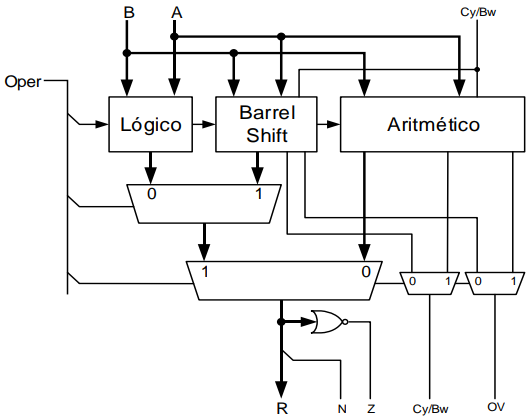

### Bus Interface Unit - BIU

In order to make the internal architecture of the data, address and control bus, as well as other signals associated with communication with the outside, an interface called **BIU** was created.

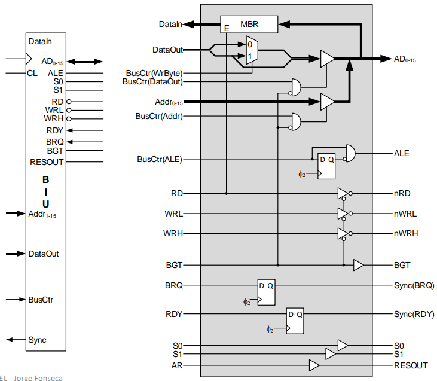

The multiplexer associated with **DataOut** aims to place the same value in the upper part of the data bus as in the lower part, when it is a one-byte write cycle, because the byte to be written in memory is always the byte with the lowest weight in the register, regardless of whether the value of the address where it is going to be written is odd or even.

The flip-flop associated with the **ALE** signal aims to generate a signal with the half-period duration of the **MCLK** signal.

The **P16** is a synchronous structure, i.e. the various actions are determined by a clock signal connected to the **MCLK** pin and which comes from an external clock source. It is this signal that defines the sequence of states that leads **P16** to execute the instructions of a program, as well as the rhythm at which it executes them.

The temporal diagram shows **MCLK** which is a signal with a *duty cycle of 50%* and a frequency of **50KHz**.

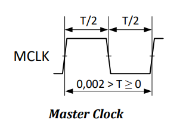

#### RESET and RESOUT

**RESET** is the signal that brings the CPU to the *initial state* and corresponds to putting the state machine in the zero state, the **PC** and **PSR** registers with the value zero. This entry is enabled with the logical value zero and has an asynchronous characteristic, which implies that while it is active the **CPU** remains in the reset state. Activation of the **RESET** signal causes the **P16** to activate the output **RESOUT**. After the **RESET** signal is deactivated, the **P16** remains in the reset state until a downward transition of the **MCLK** signal occurs, as shown in the time diagram in the figure. This signal is intended to inform devices external to the **CPU** that it has undergone a reset action.

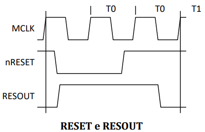

#### ADDRESS and DATA BUS (AD<sub>0-15</sub>)

In order to reduce the number of **CPU** pins, the same 16-bit bus will be used to transfer *data* and *addresses*. To do this, the **CPU** provides a signal called **ALE (Address Latch Enable)** to validate the information present in the **AD<sub>0-15</sub>** bus as an address. This same bus circulates data information that the **CPU** validates with the **nRD**, **nWRL** and **nWRH** signals. This will require the system architecture to include a **LATCH of 16 bits** to register the address, thus ensuring the stability of the address bus throughout the read or write cycle. Block diagram of a minimal system based on P16.

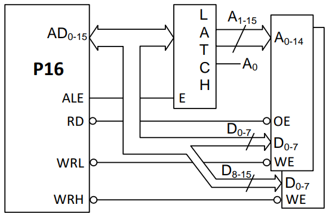

Although the *memory space* of the P16 is **64K x 8**, it is organized into two spaces of **32K x 8** bits. This organization is due to the fact that the data transfer instructions between the **CPU** and memory, you can specify whether a transfer is 8-bit or 16-bit.

In the case of a *byte read*, the **CPU** activates the **RD** signal, reads the 16 bits corresponding to the address established by the **LATCH** and, inside the **CPU**, selects the high or low part of the logical value of the **A0** address bit to be 0 or 1 respectively (see the block diagram of P16).

In the case of *writing a byte*, the **CPU** places the 8 bits with the highest and lowest weight of the data bus, the 8 bits with the lowest weight of the **RS** source register, and activates the **WRH** or **WRL** signal function of the logical value of the A0 address bit. An even address corresponds to the byte with the lowest weight (see BIU). If the write is 16 bits, it activates both **WRH** and **WRL** signals simultaneously.

#### READING AND WRITING CYCLES

The P16 read and write cycles have the following temporal diagram:

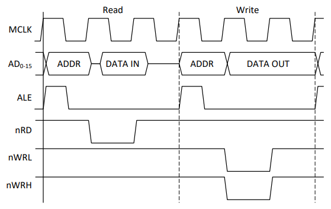

In the first cycle of **MCLK** prepares the address, in the second cycle of **MCLK** performs the reading or writing, the third cycle serves, in the reading, to wait for the release of the bus by part of the device read, and in writing to ensure **T<sub>DH</sub>** to the device that was written. These cycles are usually referred to as machine cycles.

#### MACHINE CYCLES

The machine cycle is the cycle of reading or writing to memory. The P16 has two types of machine cycles: 

- the **OP CODE FETCH** cycle, in which the CPU reads from memory the code of the instruction to be executed
- the **EXECUTE** cycle associated with the **LDR** and **STR** instructions, to read or write to memory a value associated with a variable. 

In the example, the **op code fetch** and the **execute** of two instructions are represented; one with internal processing only, and the other with write access to memory.

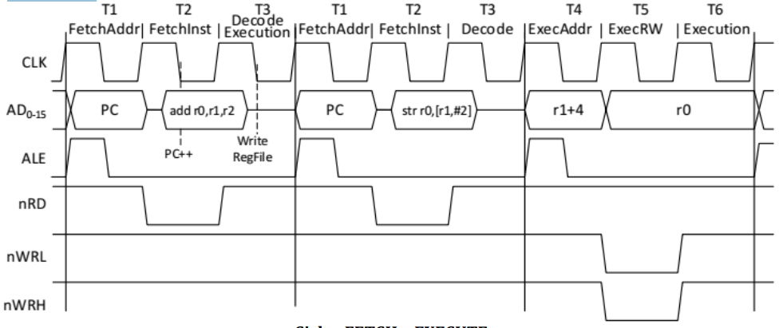

The **OP CODE FETCH** cycle consists of a sequence of *3 states* from **T1** to **T3**, being 

- **T1** for *address preparation, 
- **T2** for reading the instruction, and 
- **T3** for decoding and execution. 

In the **T3 cycle**, if it is an **LDR** or **STR** instruction, there is no execution and is preceded by **T4**, **T5** and **T6**, a *read cycle* if the executing instruction is **LDR**, or a *write cycle*, if the instruction is **STR**. In the case of the **STR** statement, the execution state does not perform any action internally to the processor. In the case of the **LDR** statement, in the middle of the execution state, the **Register File** is written.

It should be noted that the **PC** registry is incremented in the middle of **T2**, so the execution of an instruction that uses the contents of the **PC** registry (R15), you have to note that its value is that of the address of the next instruction. 

In any of the architectures studied so far, the reading of a new instruction only begins after the decoding and execution of the previous instruction.

#### SYNCHRONIZATION AND INTERACTION WITH EXTERNAL DEVICES

Given the structure of the P16, with a single address space, it is understood that this space will be populated by different types of devices. We will have non-volatile memory devices (ROM, flash, etc.) to contain code, memory devices supporting reading and writing (SRAM, DRAM, etc.) to contain data, and even the existence of devices that allow data to be sent in and out to the outside of the system.

This multiplicity of devices and interactions implies that the processor has mechanisms of synchronization, which allows you to adapt to the temporal specificities of each of the devices without compromising the overall performance of the system.

##### READY - RDY

The insertion of a slow device (**TOE** and **TWP** very large) into the system, should not imply a uniform CPU speed, such that, the timing of that device is satisfied. For this purpose, an entry called **RDY (Ready)** has been added to the P16 which, when active, means that the CPU will be able to terminate the current read or write action.

This signal will be tested by the CPU before the end of the read or write cycle, and if it is disabled, the CPU will go into a wait state, extending the current cycle indefinitely until the **RDY** signal becomes active. The time diagram shows the moment of observation of the **RDY** signal (in the middle of the **nRD**, **nWRL** or **nWRH** signal) and its consequence on the behavior of the CPU bus.

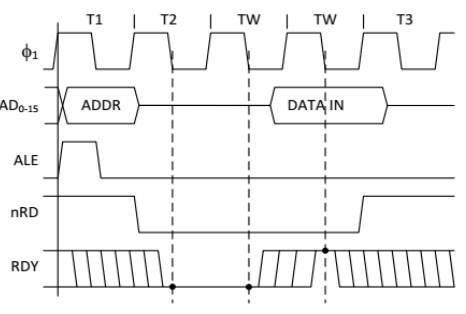

In the example we can see that two Wait states were generated, which led to the **nRD** signal being active for 3 cycles of the clock signal.

The management of this input can be carried out in one of two ways, namely: 

- normally ready  
- normally not ready

In **normally ready mode**, the **RDY** input is kept active at all times and is zeroed out by the addressed device if you want to generate standby states. 

In **normally not ready mode**, the **RDY** signal is kept at zero, and if the addressed device does not want to require standby status, the **RDY** input is activated. The latter has the advantage of allowing the logic associated with the addressed device to be slower to react without running the risk of not producing the waiting time that was required

The **RDY** signal is also commonly used by the system designer to detect and correct design or implementation errors in both hardware and software. As can be seen in the figure, by disabling the **RDY** input, the CPU crystallizes the address, data and control buses, allowing the designer to statically check the behavior of the logic associated with the device being addressed and what the value of the data that is being transferred. If a circuit is built that *cycle-by-cycle* machine disables the **RDY** signal, we can follow the CPU execution step by step.

#### BUS SHARING

##### DIRECT MEMORY ACCESS - DMA

Another common scenario in microprocessor-based systems, which aims to reduce the data transfer time between an **I/O device** and the memory, is the **DMA (Direct Memory Access)** transfer, that is, the system has a **DMA** device that uses the CPU bus to transfer information between the **I/O device** and the memory.  no CPU intervention.

In this situation, upon receiving a request from the **DMA** device, the CPU releases the address, data, and control buses (**nRD** and **nWR**), placing them at high impedance, and enters a passive hold state, while informing the **DMA** device that the transfer can now take place.

The release of the BUS, i.e. the entry of the CPU in a state of hold, can only happen when the memory access cycle that may be taking place has been completed, which implies that the device requesting the bus waits for signals from the CPU to start the transfer.

##### BUS REQUEST - BRQ / BUS GRANT - BGT

To implement this feature it is necessary to add two signals to the CPU, one incoming, called **BRQ (Bus Request)** that the requesting device activates when it wants to perform a transfer, and another outgoing, called **BGT (Bus Grant)**, which the CPU uses to inform the requesting system that the bus has already been released. The CPU will remain in a state of hold as long as the **BRQ** signal is active and during this time the CPU will keep the **BGT** signal active.

In the time diagram is shown the moment of observation of the **BRQ** signal and its consequence on the behavior of the CPU and, as can be seen, **BRQ** is sampled in the middle of the clock cycle that precedes the start of a memory access (**T3** or **T6**) and, if it is active, enters a hold state, activating the **BGT** signal. While in a hold state, it samples the **BGT** input in the middle of the **TH** cycles

Since a **BRQ** request is only satisfied when the current cycle is complete, if the CPU is in a *Wait (RDY disabled) state*, it will only indicate **BGT** when it is released by the **RDY** signal and completes the cycle that was in progress. In case of simultaneous wait and hold request, since the test for these signals is done after the read or write cycle has started, the **RDY** signal has priority over the **BRQ** signal, otherwise it would imply interrupting one of the cycles.

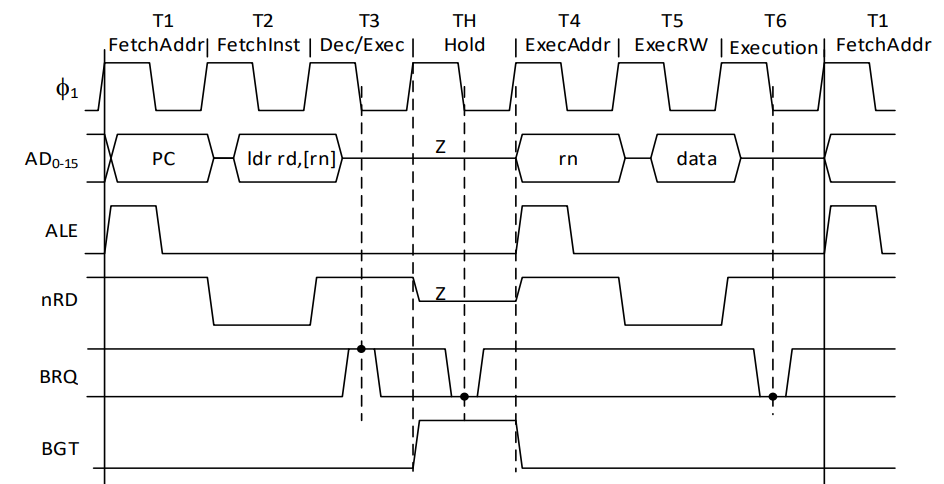

The addition of these three **RDY**, **BRQ** and **BGT** signals implies the addition of a register for synchronizing the **RDY** and **BRQ** signals with the *clock downside (f2)*, to ensure the stability of the signals when tested by the CPU control module.

#### STATE INFORMATION (S1, S0)

The P16 encodes, outwards, via two pins (**S1** and **S0**) the nature of the cycle in which the CPU is involved. These signals are positioned at the beginning of **T1** and remain so throughout the cycle, allowing you to know in advance what type of cycle the CPU is going to perform.

| S<sub>1</sub> | S<sub>0</sub> | STATE     |
| ------------- | ------------- | --------- |
| 0             | 0             | Fetch     |
| 0             | 1             | Execute   |
| 1             | 0             | Break     |
| 1             | 1             | Interrupt |

## P16 Memory Map

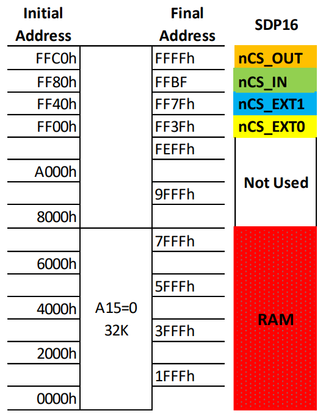

### SDP16 System Memory Map Description for P16Simulator Tool

```txt
p16

ram
id=0
databus=P16Low
addrbits=14
addrsel=0000,7FFF

ram
id=1
databus=P16High
addrbits=14
addrsel=0000,7FFF

outputport
id=2
databus=P16Low
addrsel=FFC0,FFFF

inputport
id=3
databus=P16Low
addrsel=FF80,FFBF
```

