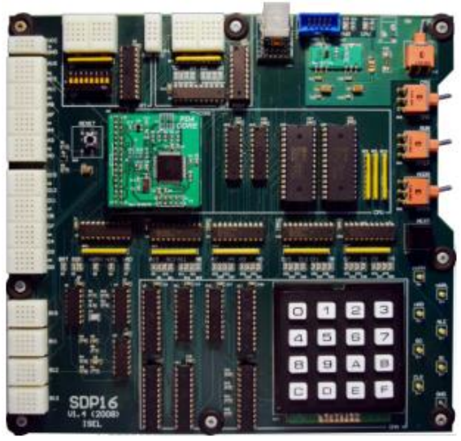

# P16 Processor

## Overview

16-bit RISC-type processor with load/store architecture

16 general-purpose records;

43 instructions organized into three classes:

- Data Manipulation Instructions

- Jumping Instructions

- Data Transfer Instructions

Supports the implementation of subroutines;

Support for the implementation of data stack structure;

64 KB memory space, 16-bit or 8-bit accessible;

Support for processing external interrupts.

